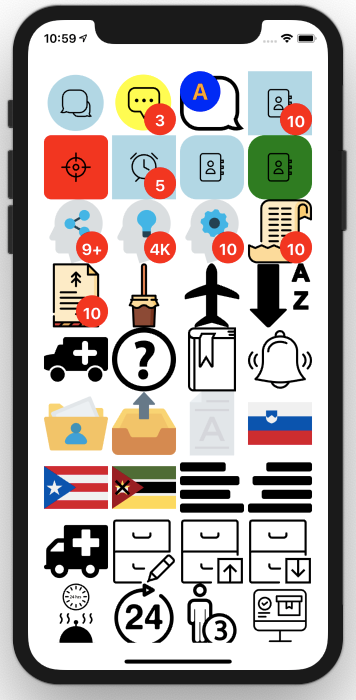
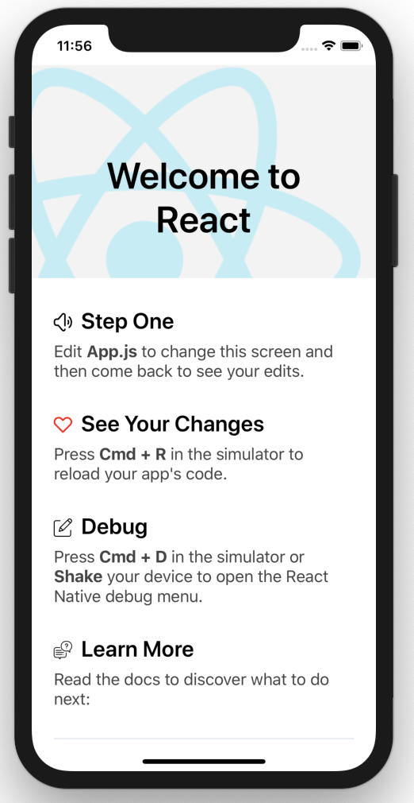

# Icons for React Native

### react-native-ico

5900 Icons for React Native

v.28.7.4

## List of Icons

- [List of all packs](http://ico.simpleness.org/packs)

## Usage

```
import Icon from 'react-native-ico';


// Inside some view component
render() {
    return (
        <Fragment>
          <Icon name="heart" />
          <Icon name="home" group="font-awesome" />
          <Icon name="speaker" height="40" width="40" />
          <Icon name="essential/trash" color="red" />
          <Icon name="home" background="circle" />
          <Icon name="home" background={{ type: "button", color: 'green' }} />
          <Icon name="home" badge="10" />
          <Icon name="home" badge={{value: 'A', fontSize: 25, radius: 22, position:'top_left', color:'orange', backgroundColor:'blue'}}/>
        </Fragment>
    );
}

```

## Installation

#### yarn

```bash
yarn add react-native-ico react-native-svg
```

#### npm

```bash
npm install --save react-native-ico react-native-svg
```

### Link react-native-svg

```bash
react-native link react-native-svg
```

### pod install ( for iOS )

```
cd ios && pod install && cd ..
```

## API

### <Icon name [group color width height background badge ...rest] />

Returns a SvgXml icon by name and group.

 name | optional | default value | description | examples
------|----------|---------------|-------------|---------
name | no |  | name of file in selected group, can contain group name before '/' sign | "home", "font-awesome/home"
group | yes | default | name of the group | "essential"
color | yes | | line color, css style | "#00ff00", "#0f0", "green"
width | yes | 20 | width of the icon | 40
height | yes | 20 | height of the icon | 40
background | no | | background type | "circle"
background | no | | background object | {type: "circle", color: 'yellow'}
badge | no | | badge string | "10"
badge | no | | badge object | {value: 'A', fontSize: 25, radius: 22, position:'top_left', color:'orange', backgroundColor:'blue'}
...rest | no | | other props | style={{backgroundColor: "#00f"}}

## Example



```
// App.js
import React from 'react';
import { SafeAreaView, StyleSheet, ScrollView, View } from 'react-native';
import Icon from 'react-native-ico';

class App extends React.Component {
  
  render() {

  return (
    <>
      <SafeAreaView>
        <ScrollView contentInsetAdjustmentBehavior="automatic">
          <View>

<View style={{flex:1, flexDirection: 'row', flexWrap: 'wrap', alignItems: 'flex-start', justifyContent:'space-between', padding:20}}>
<Icon name="speech-bubble-1" group="balloons" height="80" width="80" background="circle" />
<Icon name="speech-bubble-10" group="balloons" height="80" width="80" badge="3" background={{type: "circle", color: 'yellow'}}/>
<Icon name="speech-bubble-11" group="balloons" height="80" width="80" badge={{value: 'A', fontSize: 25, radius: 22, position:'top_left', color:'orange', backgroundColor:'blue'}}/>
<Icon name="contacs" group="basic" height="80" width="80" badge="10" background="rect" />
<Icon name="aim" group="basic" height="80" width="80" background={{type:'rect', color:'red', borderRadius:122}} />
<Icon name="clock" group="basic" height="80" width="80" badge="5" background={true} />
<Icon name="contacs" group="basic" height="80" width="80" background="button" />
<Icon name="contacs" group="basic" height="80" width="80" background={{ type: "button", color: 'green' }} />
<Icon name="share-1" group="business" height="80" width="80" badge="9+" />
<Icon name="idea-2" group="business" height="80" width="80" badge="4K" />
<Icon name="thinking" group="business" height="80" width="80" badge="10" />
<Icon name="list-1" group="christmas" height="80" width="80" badge="10" />
<Icon name="list" group="christmas" height="80" width="80" badge="10" />
<Icon name="zambomba" group="christmas" height="80" width="80" />
<Icon name="airplane-black-shape" group="coolicons" height="80" width="80" />
<Icon name="alphabetical-order-from-a-to-z" group="coolicons" height="80" width="80" />
<Icon name="ambulance" group="coolicons" height="80" width="80" />
<Icon name="leftArrow" group="default" height="80" width="80" />
<Icon name="agenda" group="essential" height="80" width="80" />
<Icon name="alarm-1" group="essential" height="80" width="80" />
<Icon name="folder-41" group="file-folder" height="80" width="80" />
<Icon name="outbox" group="file-folder" height="80" width="80" />
<Icon name="text" group="file-folder" height="80" width="80" />
<Icon name="slovenia" group="flags" height="80" width="80" />
<Icon name="puerto-rico" group="flags" height="80" width="80" />
<Icon name="mozambique" group="flags" height="80" width="80" />
<Icon name="align-to-left" group="font-awesome" height="80" width="80" />
<Icon name="align-to-right" group="font-awesome" height="80" width="80" />
<Icon name="ambulance" group="font-awesome" height="80" width="80" />
<Icon name="archive-12" group="interaction" height="80" width="80" />
<Icon name="archive-13" group="interaction" height="80" width="80" />
<Icon name="archive-14" group="interaction" height="80" width="80" />
<Icon name="24-hours-room-service" group="lodgicons" height="80" width="80" />
<Icon name="24-hours-sign" group="lodgicons" height="80" width="80" />
<Icon name="3-persons-or-person-number-three-symbol" group="lodgicons" height="80" width="80" />
<Icon name="application" group="logistics-delivery" height="80" width="80" />
<Icon name="bill" group="logistics-delivery" height="80" width="80" />
<Icon name="box" group="logistics-delivery" height="80" width="80" />
<Icon name="windows-media-player" group="logo" height="80" width="80" />
<Icon name="wechat" group="logo" height="80" width="80" />
<Icon name="waze" group="logo" height="80" width="80" />
<Icon name="add-label-button" group="material-design" height="80" width="80" />
<Icon name="add-plus-button" group="material-design" height="80" width="80" />
<Icon name="add-to-queue-button" group="material-design" height="80" width="80" />
<Icon name="right-arrow" group="miscellaneous" height="80" width="80" />
<Icon name="diagonal-arrow" group="miscellaneous" height="80" width="80" />
<Icon name="diagonal-arrow-1" group="miscellaneous" height="80" width="80" />
<Icon name="santa-claus" group="new-year" height="80" width="80" />
<Icon name="candelabra" group="new-year" height="80" width="80" />
<Icon name="star" group="new-year" height="80" width="80" />
<Icon name="western-union-1" group="payment-method" height="80" width="80" />
<Icon name="western-union" group="payment-method" height="80" width="80" />
<Icon name="wepay" group="payment-method" height="80" width="80" />
<Icon name="4g" group="phones-and-mobiles" height="80" width="80" />
<Icon name="4g plus" group="phones-and-mobiles" height="80" width="80" />
<Icon name="4g" group="phones-and-mobiles" height="80" width="80"/>
<Icon name="invoice" group="shopping" height="80" width="80" />
<Icon name="shopping-cart" group="shopping" height="80" width="80" />
<Icon name="shopping-cart-1" group="shopping" height="80" width="80" />
<Icon name="56-social-logo" group="social-icons" height="80" width="80" />
<Icon name="ads-of-the-world-logo" group="social-icons" height="80" width="80" />
<Icon name="ads-scuttlepad-logo" group="social-icons" height="80" width="80" />
<Icon name="56-social-logo" group="social-icons-rounded" height="80" width="80" />
<Icon name="ads-of-the-world-logo" group="social-icons-rounded" height="80" width="80" />
<Icon name="ads-scuttlepad-logo" group="social-icons-rounded" height="80" width="80" />
<Icon name="wikipedia" group="social-media" height="80" width="80" />
<Icon name="whatsapp" group="social-media" height="80" width="80" />
<Icon name="vine" group="social-media" height="80" width="80" />
<Icon name="docker" group="software-development" height="80" width="80" />
<Icon name="python" group="software-development" height="80" width="80" />
<Icon name="react" group="software-development" height="80" width="80" />
<Icon name="bikini" group="stylish" height="80" width="80" />
<Icon name="blush-makeup-circular-opened-case" group="stylish" height="80" width="80" />
<Icon name="bottle-black-and-rounded-shape" group="stylish" height="80" width="80" />
<Icon name="t-mobile" group="technology-logos" height="80" width="80" />
<Icon name="oppo" group="technology-logos" height="80" width="80" />
<Icon name="asus" group="technology-logos" height="80" width="80" />
<Icon name="ford" group="transport-logos" height="80" width="80" />
<Icon name="mini" group="transport-logos" height="80" width="80" />
<Icon name="porsche" group="transport-logos" height="80" width="80" />
<Icon name="bar-chart" group="ui-interface" height="80" width="80" />
<Icon name="wifi" group="ui-interface" height="80" width="80" />
<Icon name="key" group="ui-interface" height="80" width="80" />
<Icon name="arrow-pointing-to-left" group="universalicons" height="80" width="80" />
<Icon name="arrow-turning-to-right" group="universalicons" height="80" width="80" />
<Icon name="arrows-circle" group="universalicons" height="80" width="80" />
<Icon name="menu" group="default" height="80" width="80" />
<Icon name="question" group="default" height="80" width="80" />
<Icon name="add" group="essential" height="80" width="80" />
</View>
          </View>
        </ScrollView>
      </SafeAreaView>
    </>
  );
  }
};

export default App;

```


## Example



```
// App.js
/**
 * Sample React Native App
 * https://github.com/facebook/react-native
 *
 * @format
 * @flow
 */

import React from 'react';
import {
  SafeAreaView,
  StyleSheet,
  ScrollView,
  View,
  Text,
  StatusBar,
} from 'react-native';

import {
  Header,
  LearnMoreLinks,
  Colors,
  DebugInstructions,
  ReloadInstructions,
} from 'react-native/Libraries/NewAppScreen';

import Icon from 'react-native-ico';

const App: () => React$Node = () => {
  return (
    <>
      <StatusBar barStyle="dark-content" />
      <SafeAreaView>
        <ScrollView
          contentInsetAdjustmentBehavior="automatic"
          style={styles.scrollView}>
          <Header />
          {global.HermesInternal == null ? null : (
            <View style={styles.engine}>
              <Text style={styles.footer}>Engine: Hermes</Text>
            </View>
          )}
          <View style={styles.body}>
            <View style={styles.sectionContainer}>
              <Text style={styles.sectionTitle}><Icon name="heart" color="red" />  Step One</Text>
              <Text style={styles.sectionDescription}>
                Edit <Text style={styles.highlight}>App.js</Text> to change this
                screen and then come back to see your edits.
              </Text>
            </View>
            <View style={styles.sectionContainer}>
              <Text style={styles.sectionTitle}><Icon group="essential" name="like" />  See Your Changes</Text>
              <Text style={styles.sectionDescription}>
                <ReloadInstructions />
              </Text>
            </View>
            <View style={styles.sectionContainer}>
              <Text style={styles.sectionTitle}><Icon name="edit" />  Debug</Text>
              <Text style={styles.sectionDescription}>
                <DebugInstructions />
              </Text>
            </View>
            <View style={styles.sectionContainer}>
              <Text style={styles.sectionTitle}><Icon name="menu/Quiz" />  Learn More</Text>
              <Text style={styles.sectionDescription}>
                Read the docs to discover what to do next:
              </Text>
            </View>
            <LearnMoreLinks />
          </View>
        </ScrollView>
      </SafeAreaView>
    </>
  );
};

const styles = StyleSheet.create({
  scrollView: {
    backgroundColor: Colors.lighter,
  },
  engine: {
    position: 'absolute',
    right: 0,
  },
  body: {
    backgroundColor: Colors.white,
  },
  sectionContainer: {
    marginTop: 32,
    paddingHorizontal: 24,
  },
  sectionTitle: {
    fontSize: 24,
    fontWeight: '600',
    color: Colors.black,
  },
  sectionDescription: {
    marginTop: 8,
    fontSize: 18,
    fontWeight: '400',
    color: Colors.dark,
  },
  highlight: {
    fontWeight: '700',
  },
  footer: {
    color: Colors.dark,
    fontSize: 12,
    fontWeight: '600',
    padding: 4,
    paddingRight: 12,
    textAlign: 'right',
  },
});

export default App;
```

## Created by

Dimitry Ivanov <2@ivanoff.org.ua> # curl -A cv ivanoff.org.ua
