## coolicons

 -  - `<Icon group="coolicons" name="accept-1" />`
 -  - `<Icon group="coolicons" name="accept" />`
 - 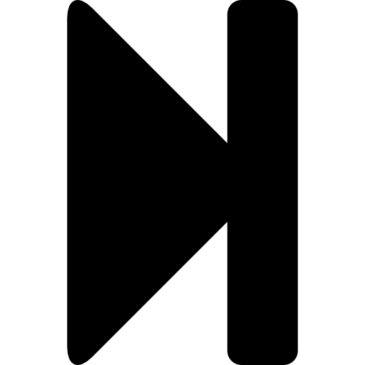 - `<Icon group="coolicons" name="advance-button" />`
 -  - `<Icon group="coolicons" name="airplane-black-shape" />`
 - 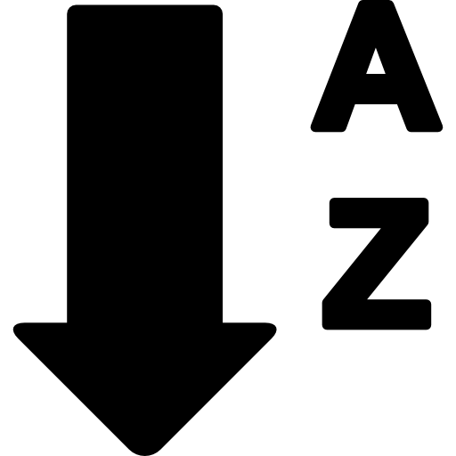 - `<Icon group="coolicons" name="alphabetical-order-from-a-to-z" />`
 -  - `<Icon group="coolicons" name="ambulance" />`
 - 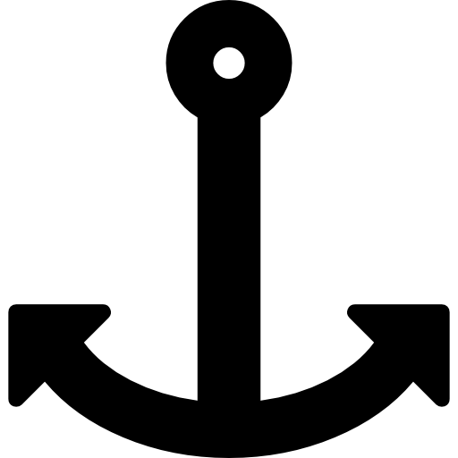 - `<Icon group="coolicons" name="anchor-interface-symbol" />`
 -  - `<Icon group="coolicons" name="android-logo-1" />`
 -  - `<Icon group="coolicons" name="android-logo" />`
 -  - `<Icon group="coolicons" name="angle-arrow-pointing-down" />`
 -  - `<Icon group="coolicons" name="apple-black-shape-logo-with-a-bite-hole" />`
 - 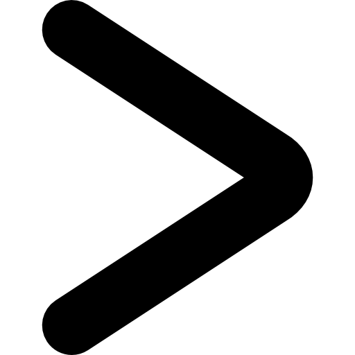 - `<Icon group="coolicons" name="arrow-angle-pointing-to-right" />`
 - 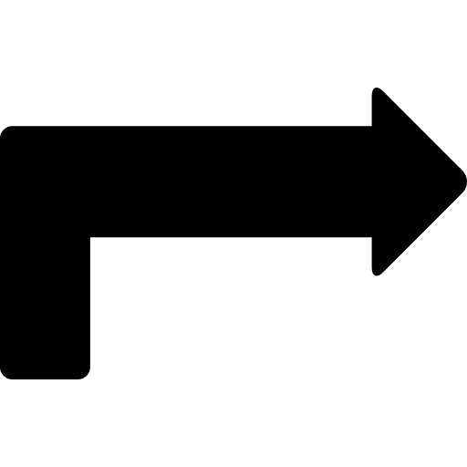 - `<Icon group="coolicons" name="arrow-long-angle-pointing-right" />`
 -  - `<Icon group="coolicons" name="arrow-pointing-upper-right-in-a-square" />`
 - 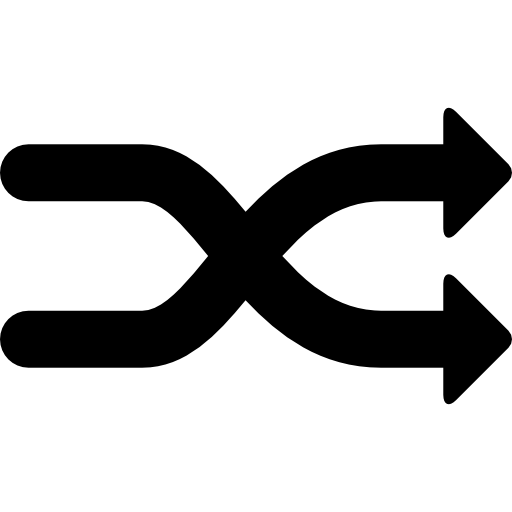 - `<Icon group="coolicons" name="arrows-shuffle-symbol" />`
 - 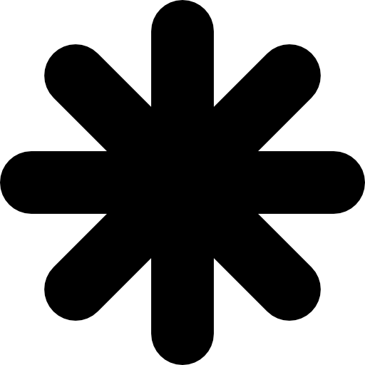 - `<Icon group="coolicons" name="asterisk-black-star-shape" />`
 -  - `<Icon group="coolicons" name="audio-tool-for-head" />`
 - 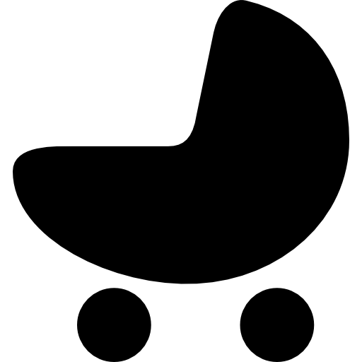 - `<Icon group="coolicons" name="baby-cradle-silhouette" />`
 - 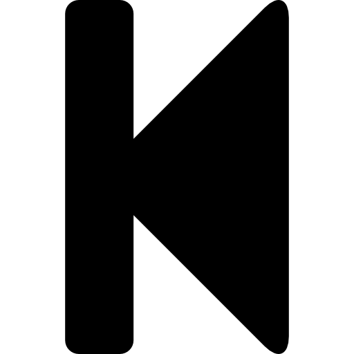 - `<Icon group="coolicons" name="back" />`
 -  - `<Icon group="coolicons" name="backward-arrows-couple" />`
 - 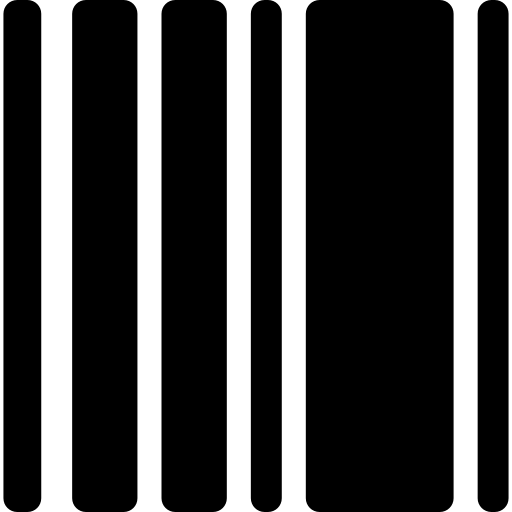 - `<Icon group="coolicons" name="barcode-square-variant" />`
 -  - `<Icon group="coolicons" name="bars-interface-symbol" />`
 - 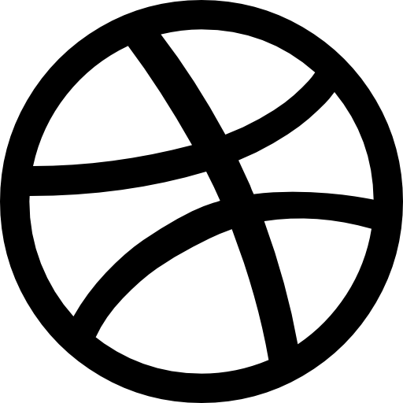 - `<Icon group="coolicons" name="basketball-ball-outline" />`
 - 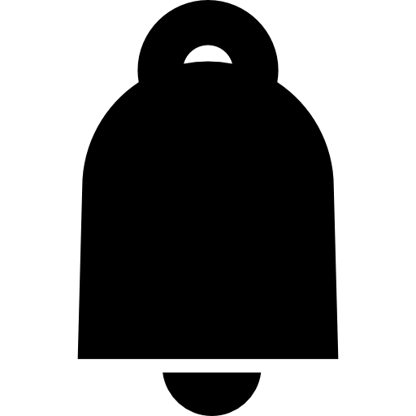 - `<Icon group="coolicons" name="bell-black-tool-shape" />`
 - 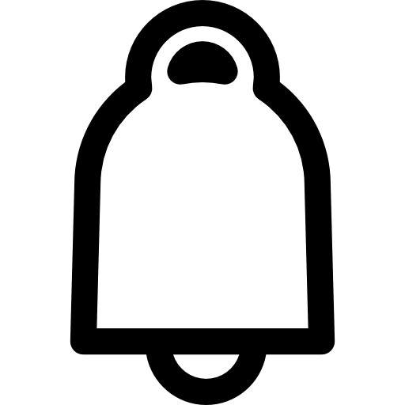 - `<Icon group="coolicons" name="bell-outline" />`
 - 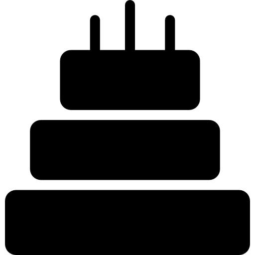 - `<Icon group="coolicons" name="birthday-cake-of-three-cakes" />`
 -  - `<Icon group="coolicons" name="bitbucket-logo-1" />`
 -  - `<Icon group="coolicons" name="bitbucket-logo" />`
 -  - `<Icon group="coolicons" name="bitcoin-symbol" />`
 -  - `<Icon group="coolicons" name="black-back-closed-envelope-shape" />`
 -  - `<Icon group="coolicons" name="black-folder-interface-symbol" />`
 - 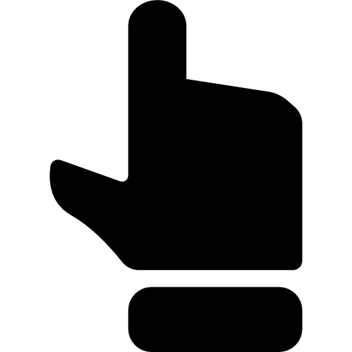 - `<Icon group="coolicons" name="black-hand-finger-pointing-up" />`
 -  - `<Icon group="coolicons" name="black-rounded-square-shape" />`
 -  - `<Icon group="coolicons" name="black-square-shape" />`
 - 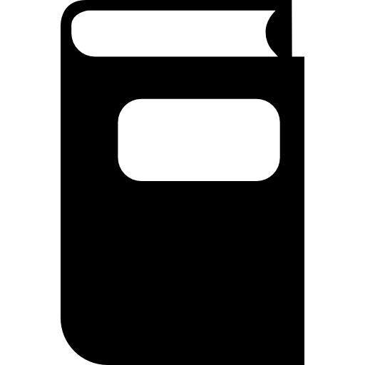 - `<Icon group="coolicons" name="book-gross-black-shape" />`
 -  - `<Icon group="coolicons" name="bookmark-black-shape" />`
 -  - `<Icon group="coolicons" name="box-from-side-view" />`
 - 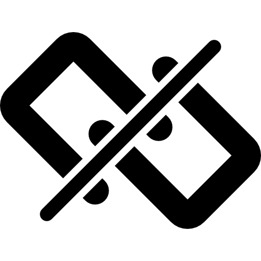 - `<Icon group="coolicons" name="broken-link-interface-symbol-of-chain-links-with-a-slash" />`
 -  - `<Icon group="coolicons" name="bug-variant-of-circular-shape-with-spots" />`
 - 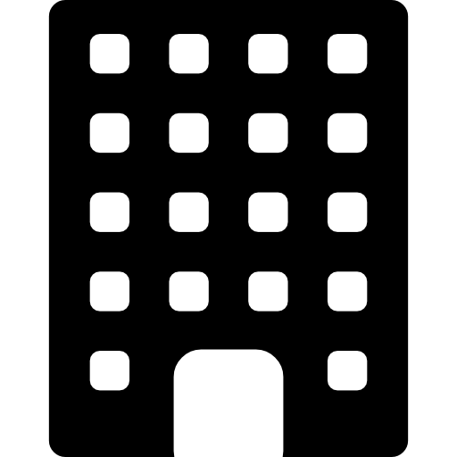 - `<Icon group="coolicons" name="building-shape" />`
 -  - `<Icon group="coolicons" name="calendar" />`
 -  - `<Icon group="coolicons" name="call-black-auricular-shape" />`
 -  - `<Icon group="coolicons" name="call-symbol-of-an-auricular-in-a-square" />`
 - 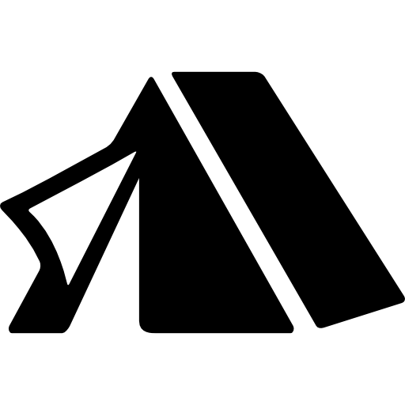 - `<Icon group="coolicons" name="camping-tent" />`
 - 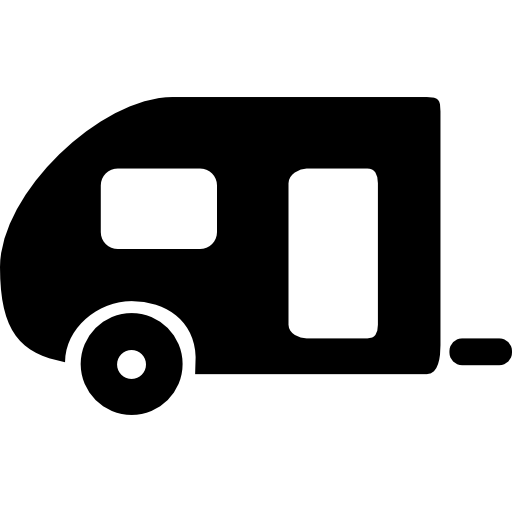 - `<Icon group="coolicons" name="camping" />`
 - 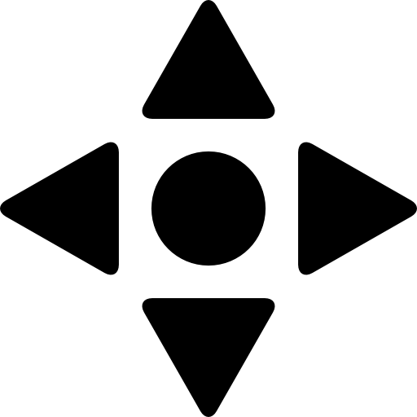 - `<Icon group="coolicons" name="cardinal-points-star-of-a-circle-with-four-triangles" />`
 -  - `<Icon group="coolicons" name="center-alignment-symbol" />`
 -  - `<Icon group="coolicons" name="check-mark-sign" />`
 - 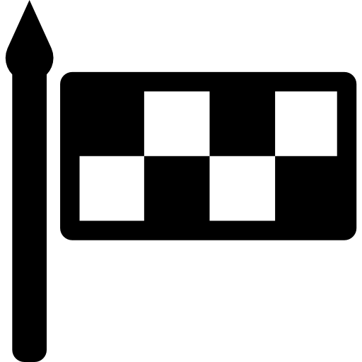 - `<Icon group="coolicons" name="checkered-flag-on-a-pole" />`
 - 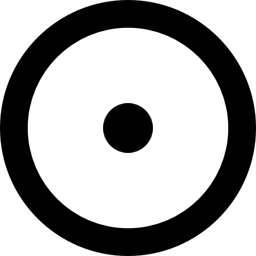 - `<Icon group="coolicons" name="circle-outline-with-a-central-dot" />`
 - 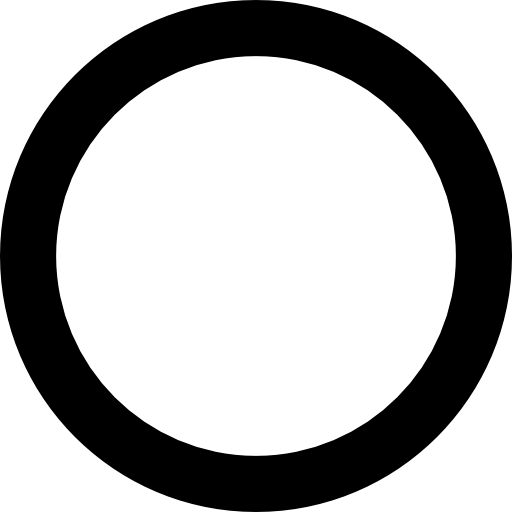 - `<Icon group="coolicons" name="circle-shape" />`
 - 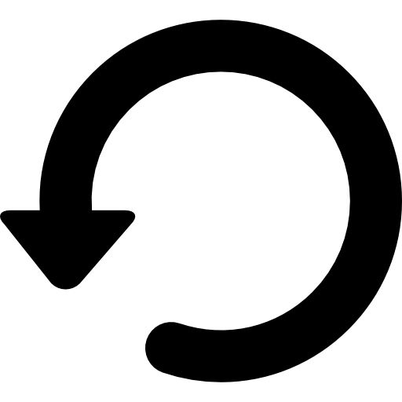 - `<Icon group="coolicons" name="circular-arrow-line" />`
 - 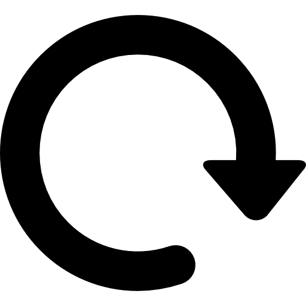 - `<Icon group="coolicons" name="circular-arrow" />`
 - 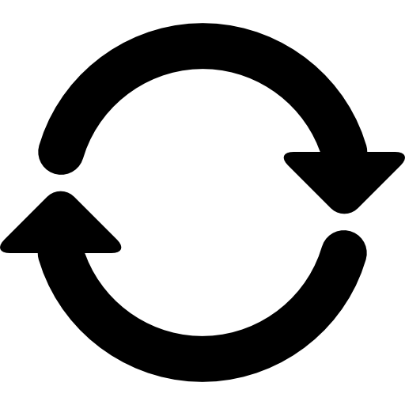 - `<Icon group="coolicons" name="circular-arrows-couple" />`
 - 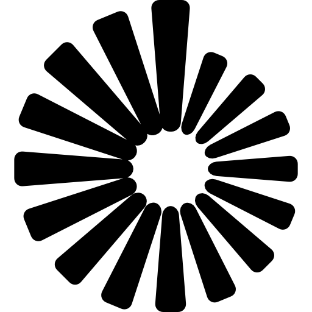 - `<Icon group="coolicons" name="circular-stairs-from-top-view" />`
 -  - `<Icon group="coolicons" name="clapper-for-cinema-filming" />`
 -  - `<Icon group="coolicons" name="clipboard-and-paper-sheet" />`
 -  - `<Icon group="coolicons" name="clock-circular-outline" />`
 -  - `<Icon group="coolicons" name="close-cross-sign-in-a-square-button" />`
 -  - `<Icon group="coolicons" name="cloud-black-shape" />`
 -  - `<Icon group="coolicons" name="code-interface-symbol-of-signs" />`
 -  - `<Icon group="coolicons" name="coffee-hot-black-cup-of-rounded-shapes" />`
 - 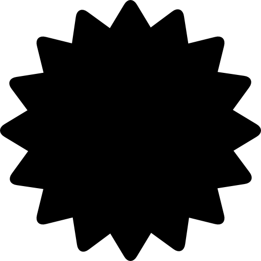 - `<Icon group="coolicons" name="commercial-label-black-shape" />`
 -  - `<Icon group="coolicons" name="compass-tool-1" />`
 - 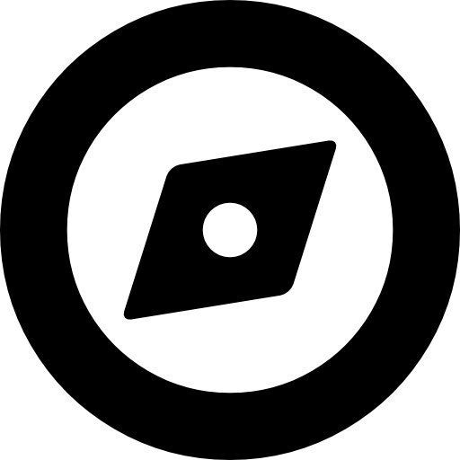 - `<Icon group="coolicons" name="compass-tool" />`
 - 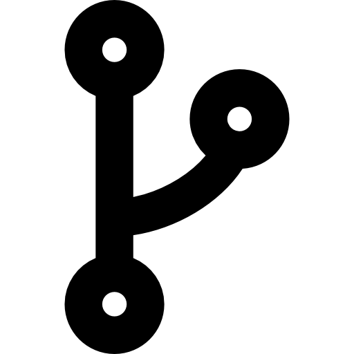 - `<Icon group="coolicons" name="connection-interface-symbol-of-three-circles-with-lines-unions" />`
 - 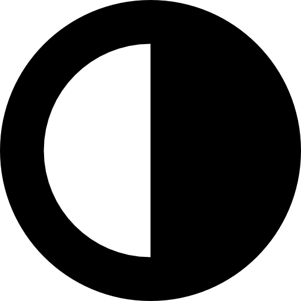 - `<Icon group="coolicons" name="contrast-interface-circular-symbol-half-black-half-white" />`
 -  - `<Icon group="coolicons" name="control-of-rectangular-shape" />`
 - 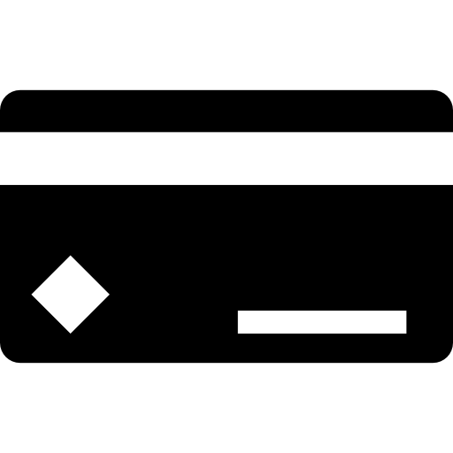 - `<Icon group="coolicons" name="credit-card-back-view" />`
 -  - `<Icon group="coolicons" name="crop-interface-symbol" />`
 - 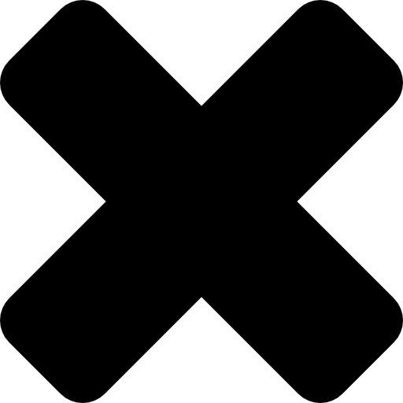 - `<Icon group="coolicons" name="cross-sign" />`
 -  - `<Icon group="coolicons" name="currency-symbol" />`
 -  - `<Icon group="coolicons" name="daily-calendar-empty-page" />`
 -  - `<Icon group="coolicons" name="delete-cross-interface-symbol" />`
 - 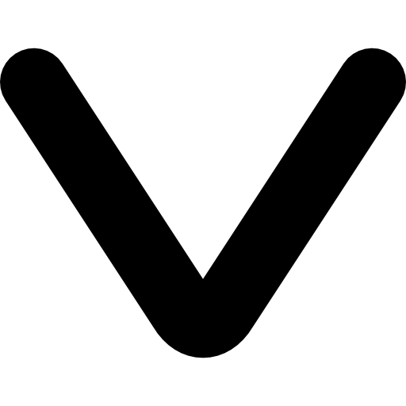 - `<Icon group="coolicons" name="descendant-arrow-angle" />`
 -  - `<Icon group="coolicons" name="diamond-ring-shape" />`
 -  - `<Icon group="coolicons" name="dice-on-three-face" />`
 - 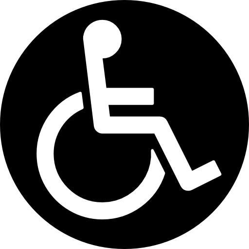 - `<Icon group="coolicons" name="discapacity-wheels-chair-circular-sign" />`
 -  - `<Icon group="coolicons" name="dislike-hand-symbol" />`
 -  - `<Icon group="coolicons" name="dollar-bill" />`
 -  - `<Icon group="coolicons" name="dollar-symbol" />`
 -  - `<Icon group="coolicons" name="double-left-arrows-angles" />`
 -  - `<Icon group="coolicons" name="down-arrow-1" />`
 - 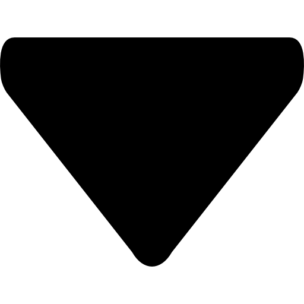 - `<Icon group="coolicons" name="down-arrow-black-triangular-variant-symbol" />`
 -  - `<Icon group="coolicons" name="down-arrow-in-a-circle-1" />`
 -  - `<Icon group="coolicons" name="down-arrow-in-a-circle-2" />`
 -  - `<Icon group="coolicons" name="down-arrow-in-a-circle" />`
 -  - `<Icon group="coolicons" name="down-arrow-triangle-in-a-square-of-gross-line" />`
 - 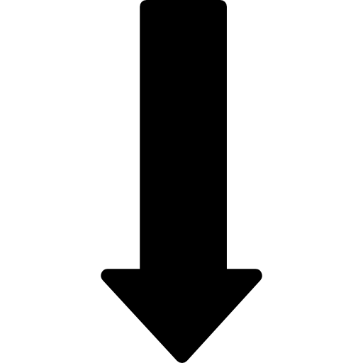 - `<Icon group="coolicons" name="down-arrow" />`
 -  - `<Icon group="coolicons" name="down-black-arrow" />`
 -  - `<Icon group="coolicons" name="download-arrow" />`
 -  - `<Icon group="coolicons" name="download-from-internet-interface-symbol" />`
 -  - `<Icon group="coolicons" name="drop-shape" />`
 -  - `<Icon group="coolicons" name="dropbox-logo" />`
 -  - `<Icon group="coolicons" name="edit-interface-symbol-of-square-paper-with-a-pencil" />`
 -  - `<Icon group="coolicons" name="euro-currency-sign" />`
 -  - `<Icon group="coolicons" name="exclamation-sign-1" />`
 -  - `<Icon group="coolicons" name="exclamation-sign-in-a-rhomb" />`
 -  - `<Icon group="coolicons" name="exclamation-sign" />`
 - 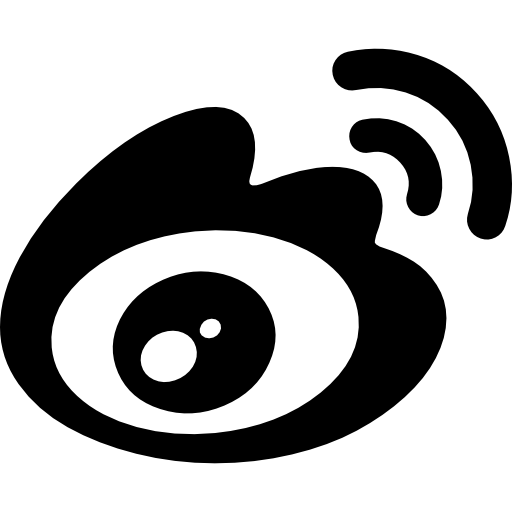 - `<Icon group="coolicons" name="eye-opened-shape-with-signal-connection-lines" />`
 -  - `<Icon group="coolicons" name="facebook-letter-logo" />`
 -  - `<Icon group="coolicons" name="facebook-logo" />`
 -  - `<Icon group="coolicons" name="fast-forward-multimedia-control-arrows" />`
 -  - `<Icon group="coolicons" name="fast-forward" />`
 -  - `<Icon group="coolicons" name="female-silhouette" />`
 - 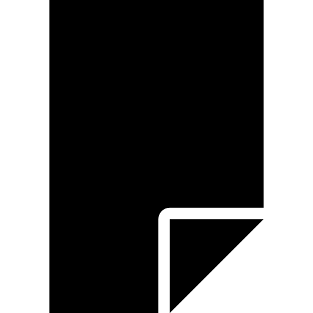 - `<Icon group="coolicons" name="file-black-paper-sheet-interface-symbol" />`
 - 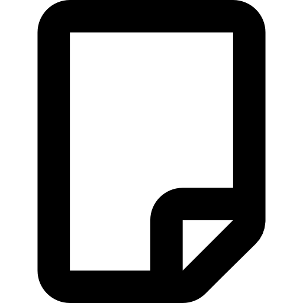 - `<Icon group="coolicons" name="file-gross-interface-symbol" />`
 -  - `<Icon group="coolicons" name="file-gross-outline-interface-symbol" />`
 - 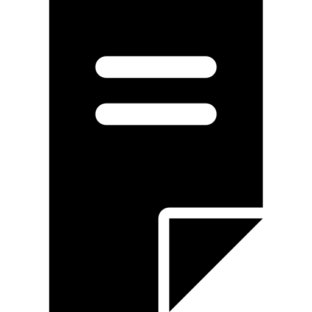 - `<Icon group="coolicons" name="file-interface-symbol" />`
 -  - `<Icon group="coolicons" name="film-clapperboard" />`
 -  - `<Icon group="coolicons" name="film-strip-of-cinema-symbol" />`
 - 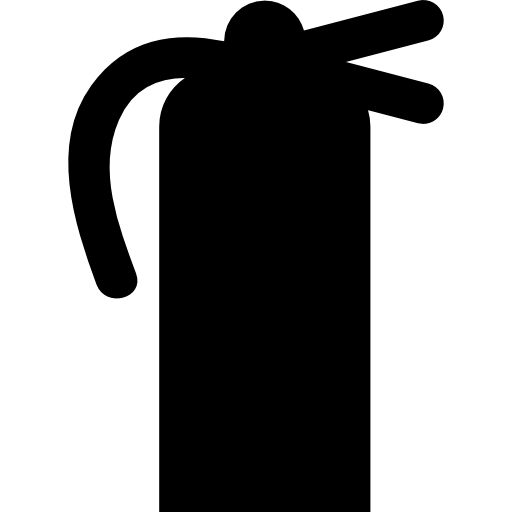 - `<Icon group="coolicons" name="fire-extinguisher-black-tool-shape" />`
 - 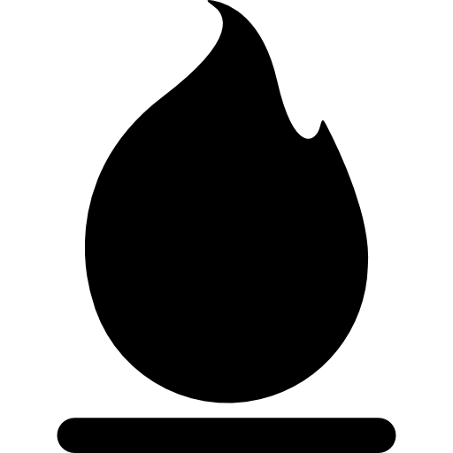 - `<Icon group="coolicons" name="fire-gross-flame-black-symbol" />`
 -  - `<Icon group="coolicons" name="fire-with-logs-cross" />`
 -  - `<Icon group="coolicons" name="first-aid-kit-box-with-cross-sign" />`
 - 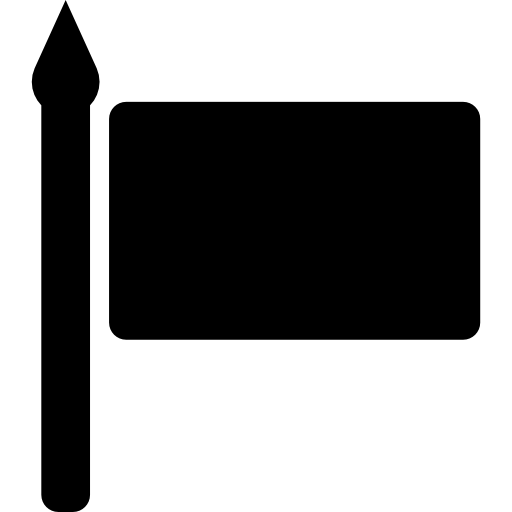 - `<Icon group="coolicons" name="flag-black-tool-shape" />`
 - 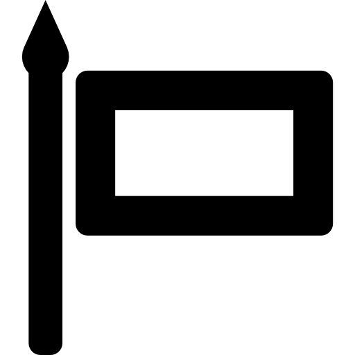 - `<Icon group="coolicons" name="flag-of-rectangle-outline-on-a-pole" />`
 -  - `<Icon group="coolicons" name="flask-glass-container-with-liquid-inside" />`
 -  - `<Icon group="coolicons" name="flickr-logo-variant-of-two-dots-in-a-rounded-square" />`
 - 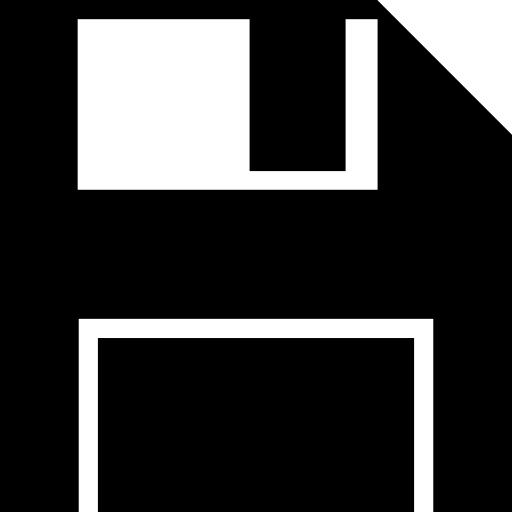 - `<Icon group="coolicons" name="floppy-disk-interface-symbol-for-save-option-button" />`
 -  - `<Icon group="coolicons" name="flower-with-ribbon-tails" />`
 -  - `<Icon group="coolicons" name="folder-black-shape" />`
 -  - `<Icon group="coolicons" name="folder-gross-outline-shape-interface-symbol" />`
 -  - `<Icon group="coolicons" name="folder-gross-symbol-for-interface" />`
 -  - `<Icon group="coolicons" name="font-interface-symbol" />`
 -  - `<Icon group="coolicons" name="four-circles-black-group" />`
 -  - `<Icon group="coolicons" name="four-horizontal-lines-interface-symbol" />`
 -  - `<Icon group="coolicons" name="four-squares-black-shapes" />`
 - 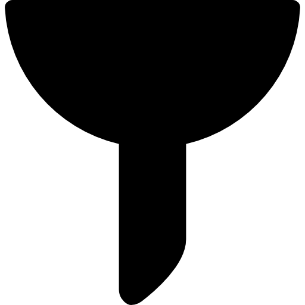 - `<Icon group="coolicons" name="funnel-black-shape-interface-symbol" />`
 -  - `<Icon group="coolicons" name="giftbox-black-variant-with-a-ribbon-on-top" />`
 -  - `<Icon group="coolicons" name="github-logo-face" />`
 -  - `<Icon group="coolicons" name="github-logo-silhouette-in-a-square" />`
 - 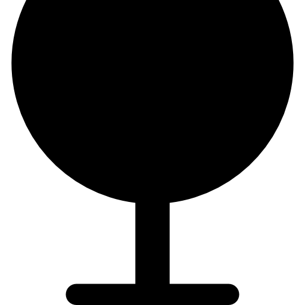 - `<Icon group="coolicons" name="glass-black-shape-for-wine" />`
 - 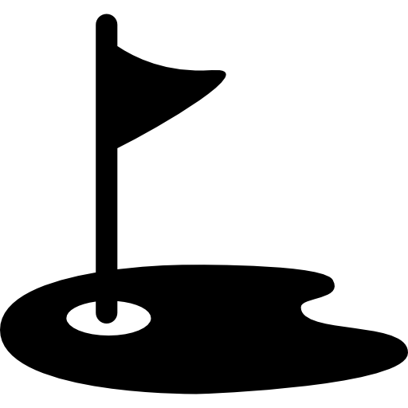 - `<Icon group="coolicons" name="golf-flag-and-field" />`
 -  - `<Icon group="coolicons" name="google-plus-logo" />`
 -  - `<Icon group="coolicons" name="google-plus-square-logo" />`
 -  - `<Icon group="coolicons" name="group-interface-symbol" />`
 - 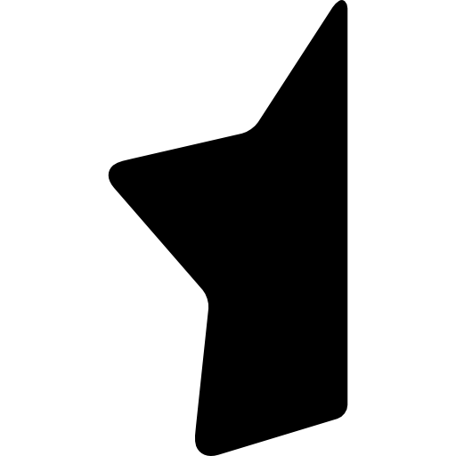 - `<Icon group="coolicons" name="half-black-star-shape" />`
 -  - `<Icon group="coolicons" name="hand-black-shape-pointing-left-with-one-finger" />`
 -  - `<Icon group="coolicons" name="hand-finger-pointing-down-like-an-arrow" />`
 -  - `<Icon group="coolicons" name="hand-finger-pointing-to-right-direction-like-an-arrow" />`
 -  - `<Icon group="coolicons" name="hard-disc" />`
 -  - `<Icon group="coolicons" name="heart-black-shape" />`
 - 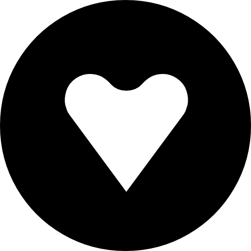 - `<Icon group="coolicons" name="heart-in-a-circle" />`
 -  - `<Icon group="coolicons" name="heart-outline-shape" />`
 -  - `<Icon group="coolicons" name="hide-interface-symbol" />`
 -  - `<Icon group="coolicons" name="home-black-shape" />`
 -  - `<Icon group="coolicons" name="hotel-building" />`
 -  - `<Icon group="coolicons" name="hotel-letter-sign" />`
 - 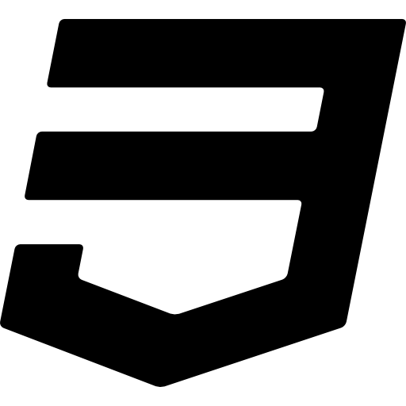 - `<Icon group="coolicons" name="html-3-logo" />`
 -  - `<Icon group="coolicons" name="html-5-logotype" />`
 - 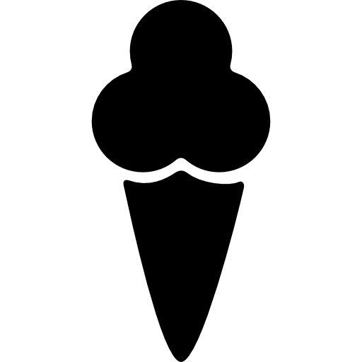 - `<Icon group="coolicons" name="ice-cream-cone-black-shape" />`
 -  - `<Icon group="coolicons" name="id-card-interface-rectangular-symbol" />`
 - 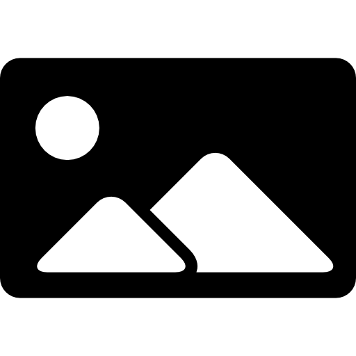 - `<Icon group="coolicons" name="image-interface-symbol-of-a-landscape" />`
 -  - `<Icon group="coolicons" name="info-letter-interface-sign" />`
 -  - `<Icon group="coolicons" name="information-sign" />`
 -  - `<Icon group="coolicons" name="instagram-photo-camera-symbol" />`
 -  - `<Icon group="coolicons" name="interface-upload-up-arrow-symbol" />`
 -  - `<Icon group="coolicons" name="italic-text-option-interface-symbol" />`
 -  - `<Icon group="coolicons" name="jar-black-shape" />`
 -  - `<Icon group="coolicons" name="key-shape" />`
 - 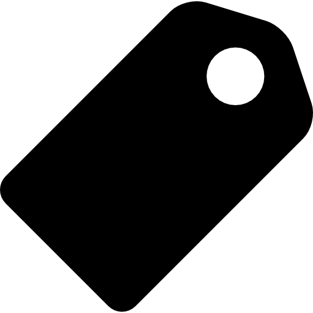 - `<Icon group="coolicons" name="label-black-shape" />`
 -  - `<Icon group="coolicons" name="laptop-with-empty-screen" />`
 -  - `<Icon group="coolicons" name="leaf-shape" />`
 -  - `<Icon group="coolicons" name="leaves-on-a-branch-silhouette" />`
 - 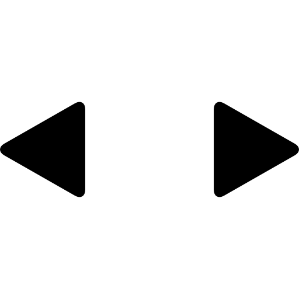 - `<Icon group="coolicons" name="left-and-right-small-triangular-arrows-couple" />`
 - 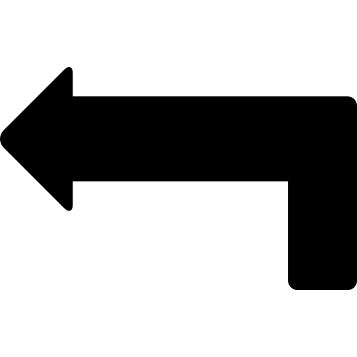 - `<Icon group="coolicons" name="left-arrow-1" />`
 -  - `<Icon group="coolicons" name="left-arrow-2" />`
 -  - `<Icon group="coolicons" name="left-arrow-angle-variant" />`
 -  - `<Icon group="coolicons" name="left-arrow-angle" />`
 -  - `<Icon group="coolicons" name="left-arrow-black-triangular-shape" />`
 -  - `<Icon group="coolicons" name="left-arrow-in-a-circle-1" />`
 -  - `<Icon group="coolicons" name="left-arrow-in-a-circle" />`
 -  - `<Icon group="coolicons" name="left-arrow-in-rounded-shape" />`
 -  - `<Icon group="coolicons" name="left-arrow-square" />`
 - 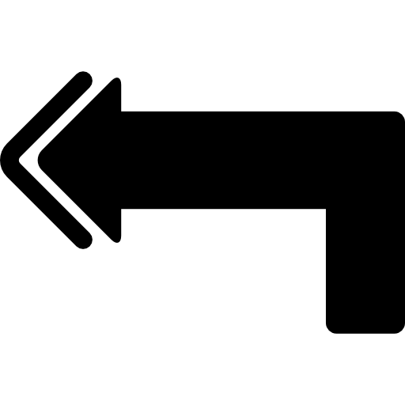 - `<Icon group="coolicons" name="left-arrow-variant" />`
 -  - `<Icon group="coolicons" name="left-arrow" />`
 -  - `<Icon group="coolicons" name="left-quotes-sign" />`
 -  - `<Icon group="coolicons" name="left-text-alignment-interface-option" />`
 -  - `<Icon group="coolicons" name="legal-hammer" />`
 - 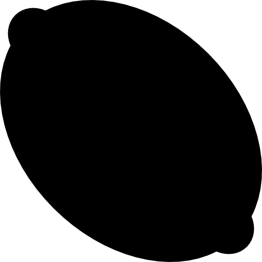 - `<Icon group="coolicons" name="lemon-shape" />`
 -  - `<Icon group="coolicons" name="less-zoom-sign" />`
 -  - `<Icon group="coolicons" name="letter-a-sign-in-a-circle" />`
 -  - `<Icon group="coolicons" name="letter-b-symbol" />`
 -  - `<Icon group="coolicons" name="level-down-arrow" />`
 - 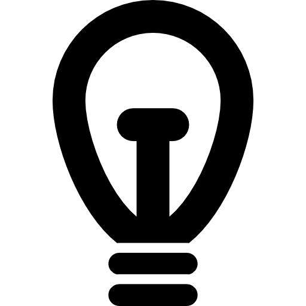 - `<Icon group="coolicons" name="lightbulb-gross-outline" />`
 -  - `<Icon group="coolicons" name="lightning-bolt-black-shape" />`
 -  - `<Icon group="coolicons" name="like-symbol-for-interface-of-black-hand-shape-with-thumb-up" />`
 -  - `<Icon group="coolicons" name="link-interface-symbol" />`
 -  - `<Icon group="coolicons" name="linked-in-logo-of-two-letters" />`
 -  - `<Icon group="coolicons" name="linkedin-square-logo" />`
 -  - `<Icon group="coolicons" name="linux-penguin" />`
 - 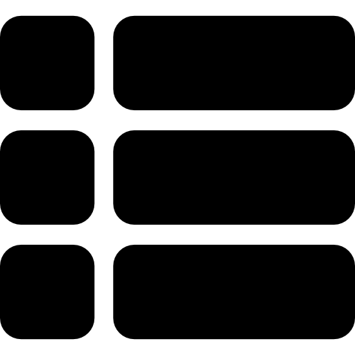 - `<Icon group="coolicons" name="list-1" />`
 - 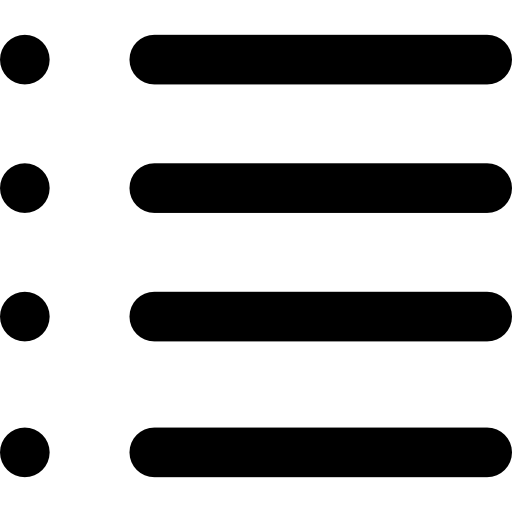 - `<Icon group="coolicons" name="list-interface-symbol" />`
 -  - `<Icon group="coolicons" name="list" />`
 -  - `<Icon group="coolicons" name="locked-padlock-security-interface-symbol" />`
 -  - `<Icon group="coolicons" name="logo-of-striped-rounded-square-speech-bubble-shape" />`
 -  - `<Icon group="coolicons" name="magic-wand" />`
 -  - `<Icon group="coolicons" name="magnet" />`
 -  - `<Icon group="coolicons" name="man-standing-black-silhouette" />`
 - 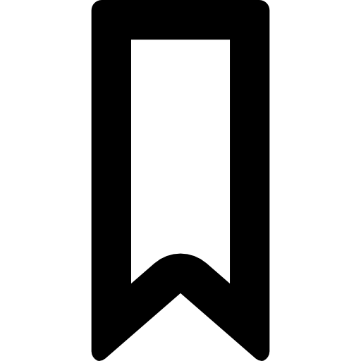 - `<Icon group="coolicons" name="marker-outline" />`
 -  - `<Icon group="coolicons" name="maxcdn-letter-logo" />`
 -  - `<Icon group="coolicons" name="md" />`
 - 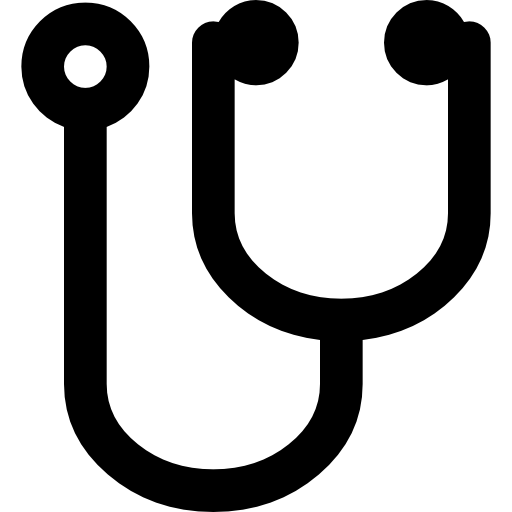 - `<Icon group="coolicons" name="medical-tool-to-listen-heart-beats" />`
 -  - `<Icon group="coolicons" name="megaphone-silhouette" />`
 - 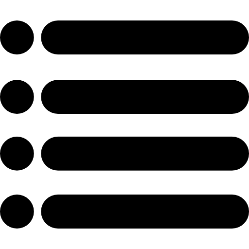 - `<Icon group="coolicons" name="menu-interface-symbol-of-four-horizontal-lines-with-dots" />`
 -  - `<Icon group="coolicons" name="menu-interface-symbol-of-three-horizontal-straight-lines" />`
 -  - `<Icon group="coolicons" name="message-black-speech-bubble-of-rectangular-shape" />`
 -  - `<Icon group="coolicons" name="microphone-voice-interface-symbol" />`
 -  - `<Icon group="coolicons" name="microphone-with-slash-interface-symbol-for-mute-audio" />`
 -  - `<Icon group="coolicons" name="minus-sign-in-a-square-1" />`
 -  - `<Icon group="coolicons" name="minus-sign-in-a-square" />`
 - 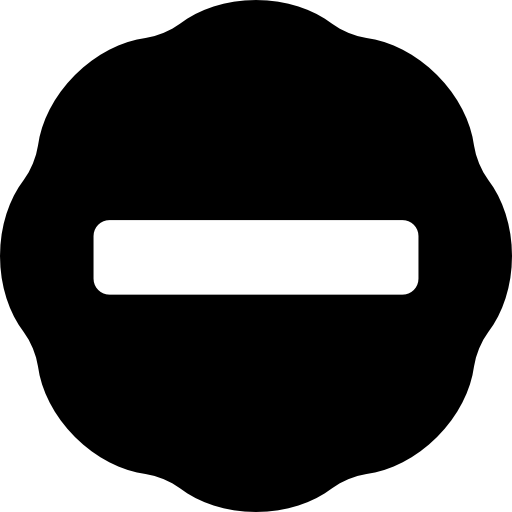 - `<Icon group="coolicons" name="minus-sign" />`
 -  - `<Icon group="coolicons" name="minus-straight-horizontal-line-sign" />`
 -  - `<Icon group="coolicons" name="monitor" />`
 -  - `<Icon group="coolicons" name="moon-shape" />`
 -  - `<Icon group="coolicons" name="music-disc" />`
 -  - `<Icon group="coolicons" name="music-discs" />`
 -  - `<Icon group="coolicons" name="musical-disc" />`
 -  - `<Icon group="coolicons" name="musical-note-black-shape" />`
 - 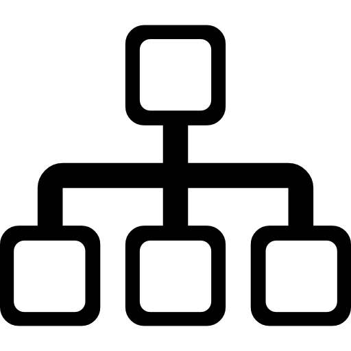 - `<Icon group="coolicons" name="network-or-hierarchy-graphic" />`
 -  - `<Icon group="coolicons" name="new-email-black-back-envelope-symbol-of-interface" />`
 - 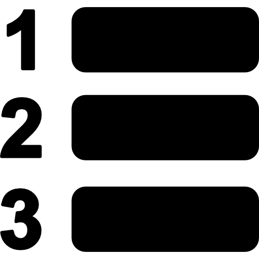 - `<Icon group="coolicons" name="numbered-list" />`
 -  - `<Icon group="coolicons" name="opposite-arrows-couple" />`
 -  - `<Icon group="coolicons" name="order-interface-symbol-with-down-arrow" />`
 - 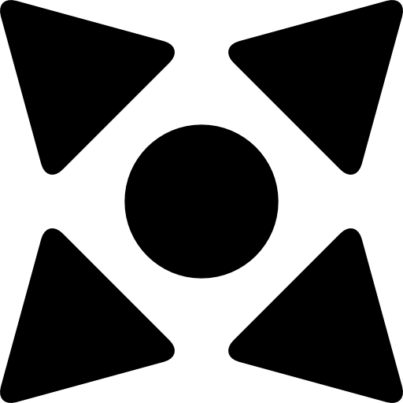 - `<Icon group="coolicons" name="orientation-winds-star-pointing-cardinal-points" />`
 -  - `<Icon group="coolicons" name="overflowing-stacked-papers-tray" />`
 -  - `<Icon group="coolicons" name="padlock-locked-black-shape" />`
 - 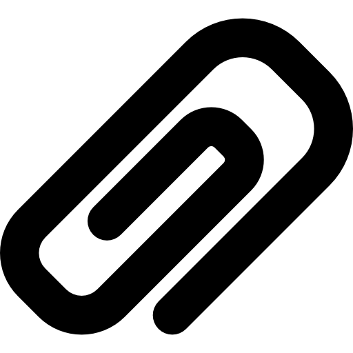 - `<Icon group="coolicons" name="paperclip-spiral" />`
 - 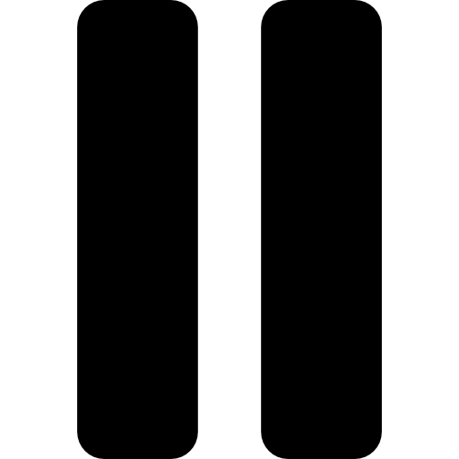 - `<Icon group="coolicons" name="pause" />`
 -  - `<Icon group="coolicons" name="paw-black-shape" />`
 - 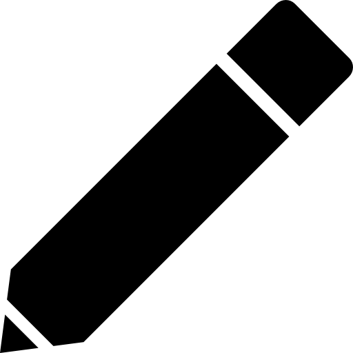 - `<Icon group="coolicons" name="pencil-black-tool-interface-symbol" />`
 -  - `<Icon group="coolicons" name="pencil-in-a-square-interface-symbol-of-gross-outline" />`
 - 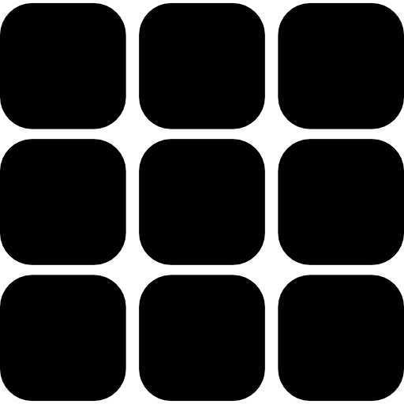 - `<Icon group="coolicons" name="phone-keys-black-nine-squares" />`
 -  - `<Icon group="coolicons" name="phone-shape" />`
 -  - `<Icon group="coolicons" name="photo-camera-interface-symbol-1" />`
 -  - `<Icon group="coolicons" name="photo-camera-interface-symbol" />`
 -  - `<Icon group="coolicons" name="photo-camera-of-square-shape" />`
 - 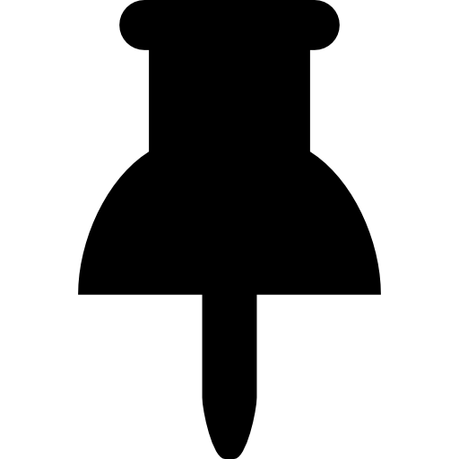 - `<Icon group="coolicons" name="pin-black-tool-shape" />`
 -  - `<Icon group="coolicons" name="pinterest-circular-logo-symbol" />`
 -  - `<Icon group="coolicons" name="pinterest-letter-logo-in-a-square" />`
 - 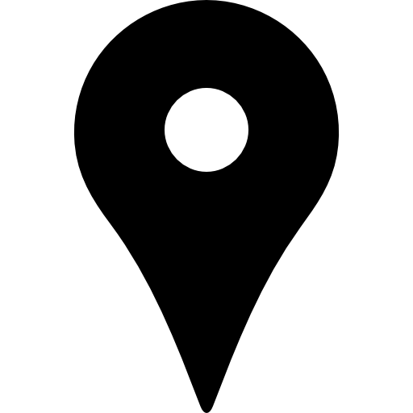 - `<Icon group="coolicons" name="placeholder-interface-symbol-for-maps" />`
 - 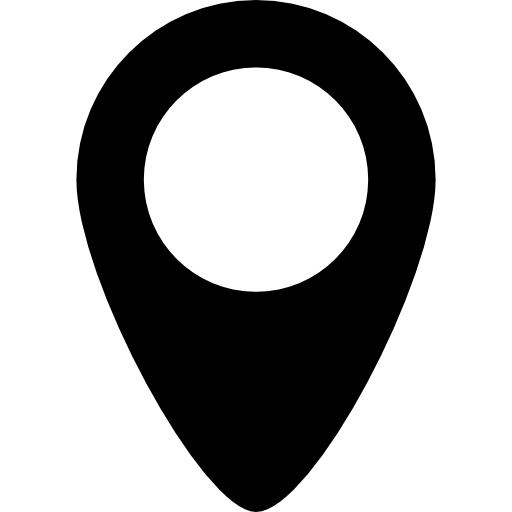 - `<Icon group="coolicons" name="placeholder" />`
 -  - `<Icon group="coolicons" name="placeholders" />`
 -  - `<Icon group="coolicons" name="play-square-button" />`
 -  - `<Icon group="coolicons" name="play-triangular-button-symbol-in-a-circle" />`
 -  - `<Icon group="coolicons" name="player-play-button-of-circular-shape" />`
 -  - `<Icon group="coolicons" name="player-play-button-symbol" />`
 - 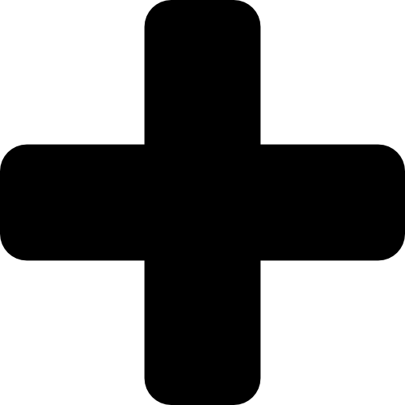 - `<Icon group="coolicons" name="plus-sign-1" />`
 -  - `<Icon group="coolicons" name="plus-sign-in-a-square-symbol-of-gross-line" />`
 -  - `<Icon group="coolicons" name="plus-sign-in-a-square" />`
 -  - `<Icon group="coolicons" name="plus-sign" />`
 -  - `<Icon group="coolicons" name="plus-zoom-interface-symbol" />`
 - 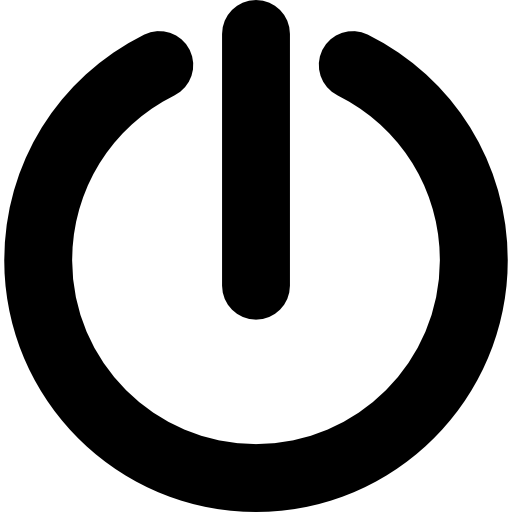 - `<Icon group="coolicons" name="power-symbol" />`
 - 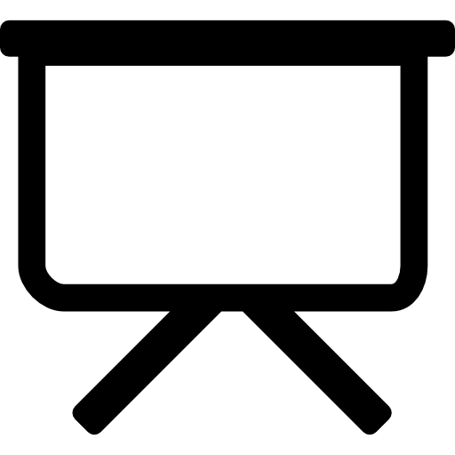 - `<Icon group="coolicons" name="presentation-screen-tool-outline-symbol" />`
 -  - `<Icon group="coolicons" name="print-interface-symbol" />`
 -  - `<Icon group="coolicons" name="prohibition-symbol-of-a-circle-with-a-slash" />`
 -  - `<Icon group="coolicons" name="puzzle-piece-black-shape-of-border" />`
 - 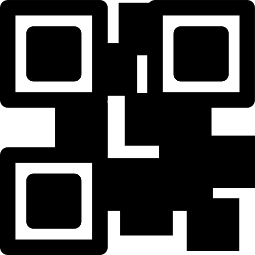 - `<Icon group="coolicons" name="qr-code-variant" />`
 -  - `<Icon group="coolicons" name="question-mark-in-circular-shape" />`
 -  - `<Icon group="coolicons" name="question-sign" />`
 - 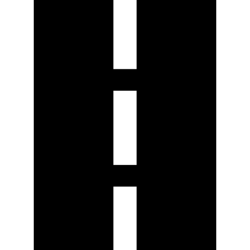 - `<Icon group="coolicons" name="rails" />`
 - 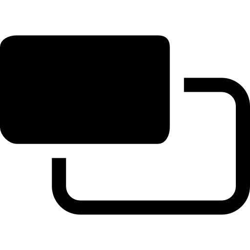 - `<Icon group="coolicons" name="rectangles-symbol" />`
 -  - `<Icon group="coolicons" name="rectangular-speech-bubble-of-chat" />`
 -  - `<Icon group="coolicons" name="recycle-bin" />`
 -  - `<Icon group="coolicons" name="renren-china-social-network-logo" />`
 -  - `<Icon group="coolicons" name="restaurant-interface-symbol-of-fork-and-knife-couple" />`
 -  - `<Icon group="coolicons" name="rewind-button" />`
 -  - `<Icon group="coolicons" name="right-arrow-angle-and-horizontal-down-line-code-signs" />`
 -  - `<Icon group="coolicons" name="right-arrow-angle-inside-a-square" />`
 -  - `<Icon group="coolicons" name="right-arrow-angle-of-two-shapes" />`
 - 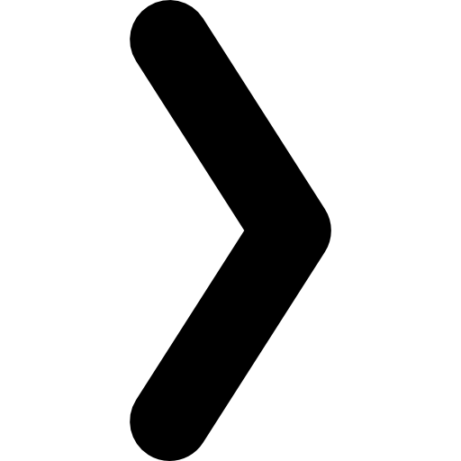 - `<Icon group="coolicons" name="right-arrow-angle" />`
 -  - `<Icon group="coolicons" name="right-arrow-black-shape" />`
 -  - `<Icon group="coolicons" name="right-arrow-black-triangle-1" />`
 -  - `<Icon group="coolicons" name="right-arrow-black-triangle" />`
 -  - `<Icon group="coolicons" name="right-arrow-direction" />`
 -  - `<Icon group="coolicons" name="right-arrow-for-forward-button-gross-symbol" />`
 -  - `<Icon group="coolicons" name="right-arrow-in-a-circle-1" />`
 -  - `<Icon group="coolicons" name="right-arrow-in-a-circle" />`
 -  - `<Icon group="coolicons" name="right-arrow-symbol" />`
 - 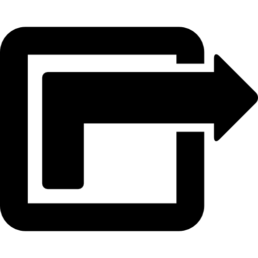 - `<Icon group="coolicons" name="right-external-arrow-of-a-square" />`
 - 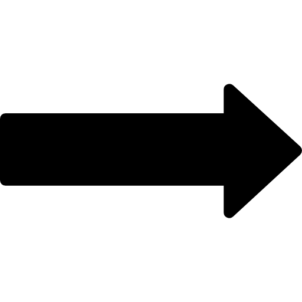 - `<Icon group="coolicons" name="right-long-black-arrow" />`
 -  - `<Icon group="coolicons" name="right-quotes-symbol" />`
 -  - `<Icon group="coolicons" name="rounded-square-corners-outline" />`
 -  - `<Icon group="coolicons" name="rss-feed-suscription-button-symbol-for-interface" />`
 -  - `<Icon group="coolicons" name="rss-feeds-symbol-in-a-rounded-square" />`
 -  - `<Icon group="coolicons" name="ruble-currency-sign" />`
 -  - `<Icon group="coolicons" name="sad-emoticon-face" />`
 -  - `<Icon group="coolicons" name="serious-emoticon-face" />`
 -  - `<Icon group="coolicons" name="shield-shape-outline" />`
 -  - `<Icon group="coolicons" name="shopping-cart-black-silhouette-rounded-variant" />`
 -  - `<Icon group="coolicons" name="sign-of-lines" />`
 -  - `<Icon group="coolicons" name="sign" />`
 -  - `<Icon group="coolicons" name="skype-logo" />`
 -  - `<Icon group="coolicons" name="small-truck-black-side-view-silhouette" />`
 -  - `<Icon group="coolicons" name="smiling-face" />`
 - 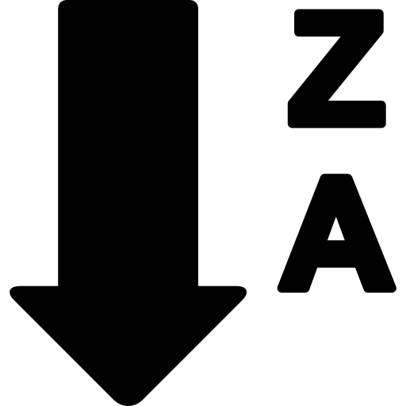 - `<Icon group="coolicons" name="sort-by-reverse-alphabet-order-interface-symbol" />`
 -  - `<Icon group="coolicons" name="sort-descending-interface-down-arrow-symbol-with-horizontal-text-lines" />`
 - 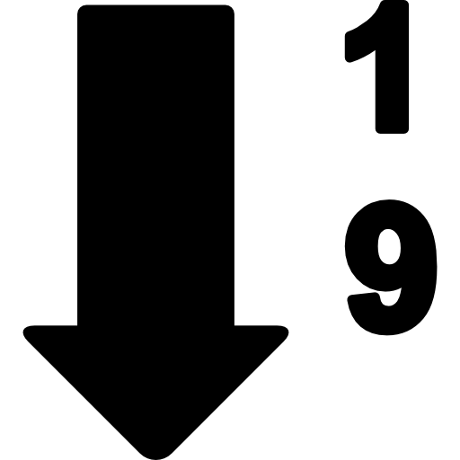 - `<Icon group="coolicons" name="sort-interface-symbol-of-down-arrow-with-numbers" />`
 - 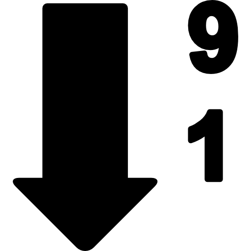 - `<Icon group="coolicons" name="sort-numerically-down-interface-symbol" />`
 - 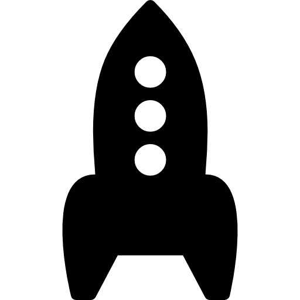 - `<Icon group="coolicons" name="space-ship" />`
 -  - `<Icon group="coolicons" name="speaker-black-tool-shape-interface-symbol" />`
 -  - `<Icon group="coolicons" name="speaker-interface-audio-symbol" />`
 -  - `<Icon group="coolicons" name="speaker" />`
 -  - `<Icon group="coolicons" name="speech-bubble-couple-of-black-rectangular-shapes" />`
 -  - `<Icon group="coolicons" name="speech-bubbles-interface-chat-symbol" />`
 -  - `<Icon group="coolicons" name="speedometer" />`
 -  - `<Icon group="coolicons" name="square-outline-shape" />`
 -  - `<Icon group="coolicons" name="square-outline-with-up-arrow" />`
 -  - `<Icon group="coolicons" name="square-outline" />`
 -  - `<Icon group="coolicons" name="square-with-two-rectangles-inside" />`
 -  - `<Icon group="coolicons" name="star-black-shape-favourite-interface-symbol" />`
 -  - `<Icon group="coolicons" name="star-gross-outline" />`
 -  - `<Icon group="coolicons" name="star-on-vip-card" />`
 -  - `<Icon group="coolicons" name="star-shape-symbol-with-half-black-and-half-white" />`
 - 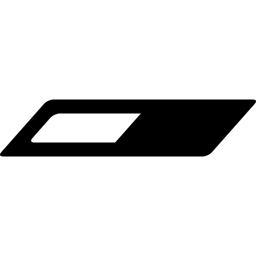 - `<Icon group="coolicons" name="status-interface-symbol" />`
 -  - `<Icon group="coolicons" name="strikethrough-text-option-interface-symbol-1" />`
 - 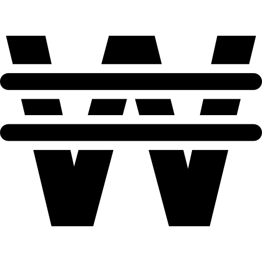 - `<Icon group="coolicons" name="strikethrough-text-option-interface-symbol" />`
 - 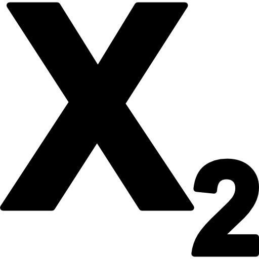 - `<Icon group="coolicons" name="subscript-interface-option-symbol" />`
 -  - `<Icon group="coolicons" name="suitcase-black-shape-1" />`
 -  - `<Icon group="coolicons" name="suitcase-black-shape" />`
 - 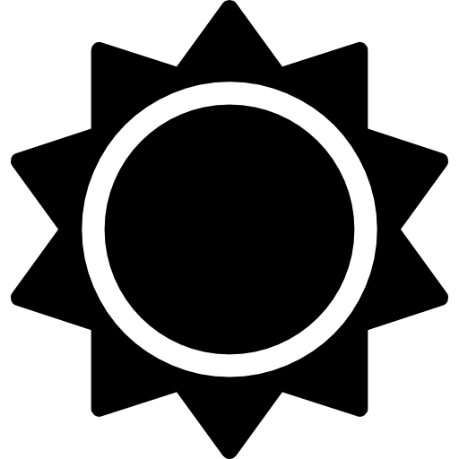 - `<Icon group="coolicons" name="sun-black-shape" />`
 - 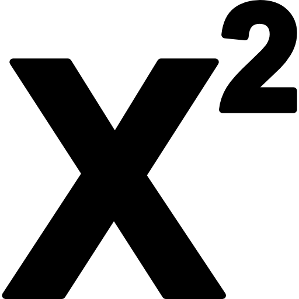 - `<Icon group="coolicons" name="superscript-symbol" />`
 -  - `<Icon group="coolicons" name="table-tennis-racquet-or-rattle-musical-instrument-black-silhouette-shape" />`
 - 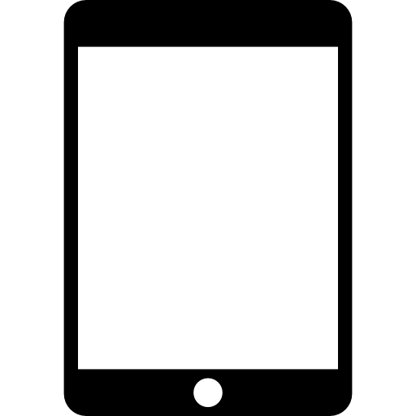 - `<Icon group="coolicons" name="tablet-tool-variant" />`
 -  - `<Icon group="coolicons" name="tag-black-tool-shape" />`
 - 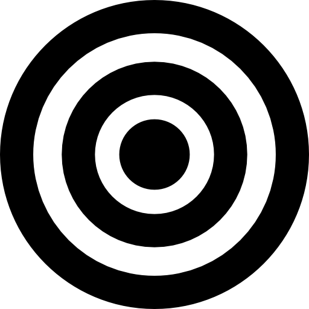 - `<Icon group="coolicons" name="target-concentric-circles-symbol" />`
 - 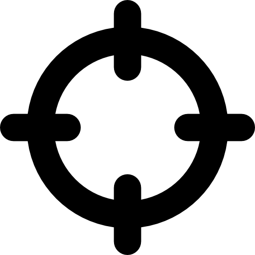 - `<Icon group="coolicons" name="targeting" />`
 -  - `<Icon group="coolicons" name="text-alignment-to-right" />`
 - 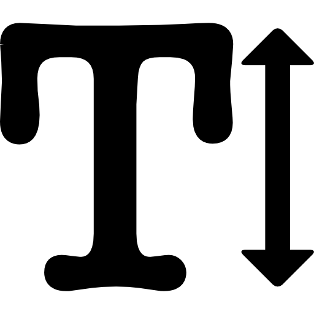 - `<Icon group="coolicons" name="text-height-format-interface-option-symbol" />`
 - 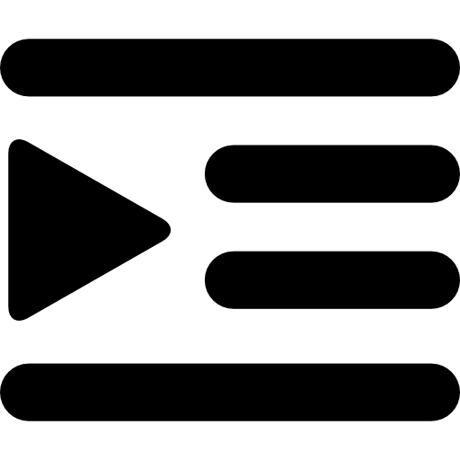 - `<Icon group="coolicons" name="text-option-interface-symbol-1" />`
 - 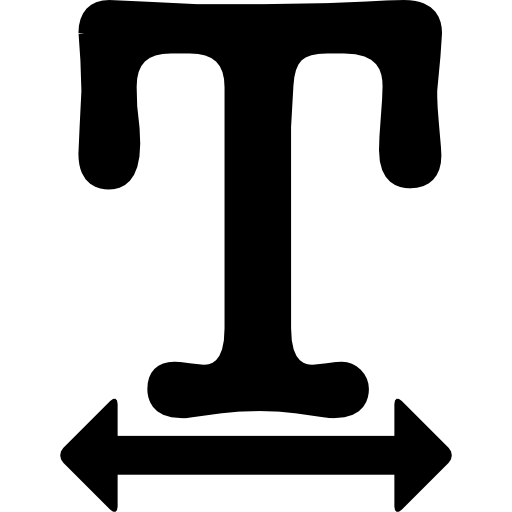 - `<Icon group="coolicons" name="text-option-interface-symbol" />`
 - 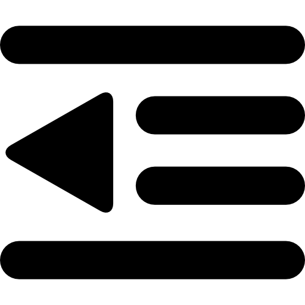 - `<Icon group="coolicons" name="text-side-option-interface-symbol" />`
 -  - `<Icon group="coolicons" name="three-aligned-squares-in-vertical-line-interface-button" />`
 -  - `<Icon group="coolicons" name="three-black-squares" />`
 - 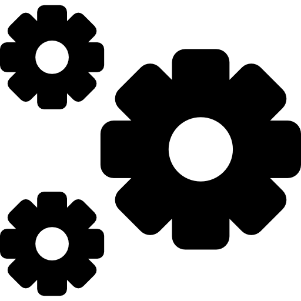 - `<Icon group="coolicons" name="three-gears-interface-symbol-for-settings" />`
 - 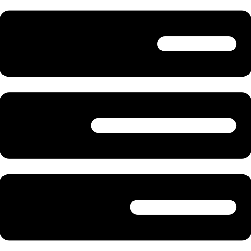 - `<Icon group="coolicons" name="three-rectangles-symbol" />`
 -  - `<Icon group="coolicons" name="three-squares-line" />`
 -  - `<Icon group="coolicons" name="thumb-down-symbol" />`
 -  - `<Icon group="coolicons" name="thumb-up-gross-line-symbol" />`
 - 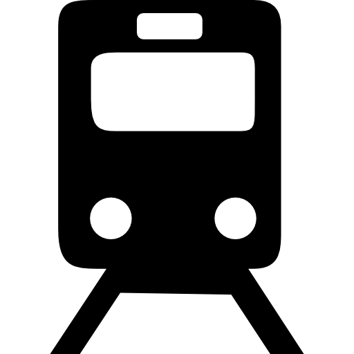 - `<Icon group="coolicons" name="train-travelling-on-railroad" />`
 - 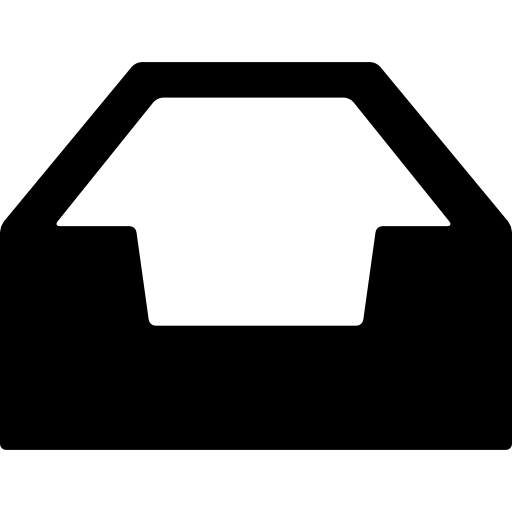 - `<Icon group="coolicons" name="tray-interface-symbol" />`
 -  - `<Icon group="coolicons" name="triangular-black-arrow-pointing-down" />`
 - 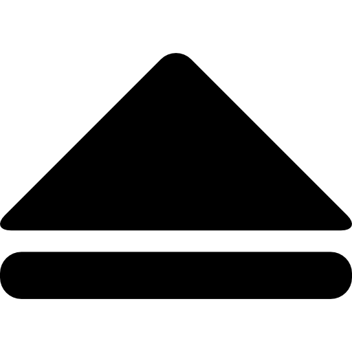 - `<Icon group="coolicons" name="triangular-up-arrow" />`
 -  - `<Icon group="coolicons" name="trophy-black-side-view-silhouette" />`
 -  - `<Icon group="coolicons" name="tumblr-letter-logo" />`
 -  - `<Icon group="coolicons" name="twitter-bird-logo-shape-in-a-square" />`
 -  - `<Icon group="coolicons" name="twitter-black-shape" />`
 -  - `<Icon group="coolicons" name="twitter-letter-logo-symbol-in-a-square" />`
 -  - `<Icon group="coolicons" name="two-arrows-in-angle-pointing-down" />`
 - 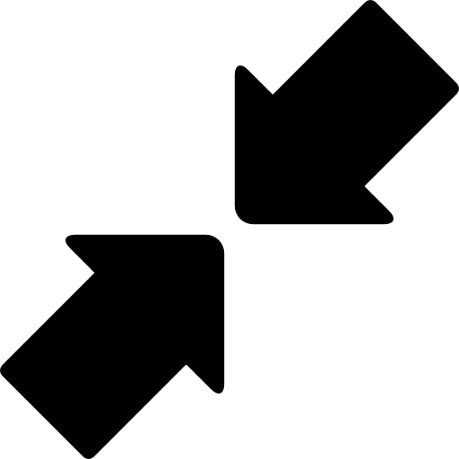 - `<Icon group="coolicons" name="two-arrows" />`
 - 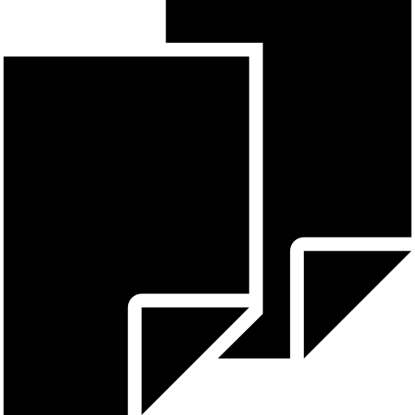 - `<Icon group="coolicons" name="two-black-paper-sheets-symbol" />`
 -  - `<Icon group="coolicons" name="two-columns-layout" />`
 - 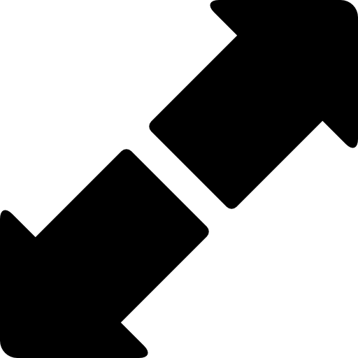 - `<Icon group="coolicons" name="two-opposite-arrows" />`
 - 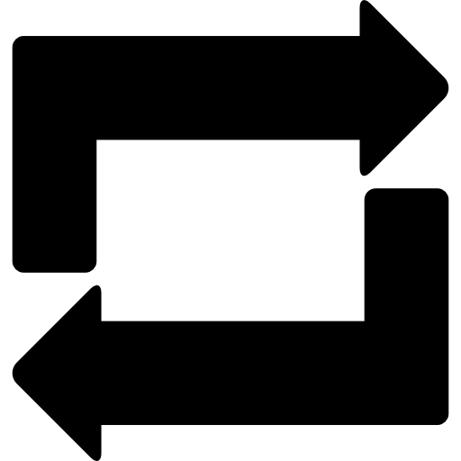 - `<Icon group="coolicons" name="two-straight-arrows" />`
 - 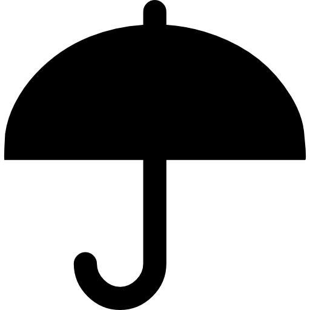 - `<Icon group="coolicons" name="umbrella-black-shape" />`
 -  - `<Icon group="coolicons" name="underline-text-option-interface-symbol" />`
 -  - `<Icon group="coolicons" name="unlocked-padlock-symbol" />`
 -  - `<Icon group="coolicons" name="unlocked-padlock" />`
 -  - `<Icon group="coolicons" name="up-and-down-arrows" />`
 - 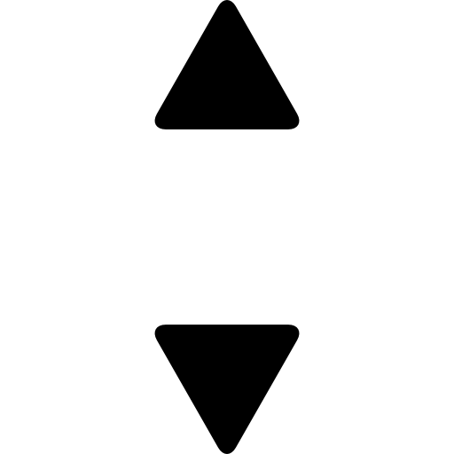 - `<Icon group="coolicons" name="up-and-down-small-triangular-arrows" />`
 -  - `<Icon group="coolicons" name="up-arrow-angle-1" />`
 - 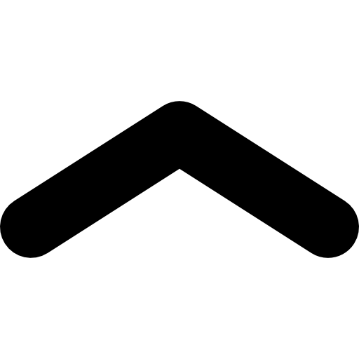 - `<Icon group="coolicons" name="up-arrow-angle" />`
 -  - `<Icon group="coolicons" name="up-arrow-in-a-circle-1" />`
 -  - `<Icon group="coolicons" name="up-arrow-in-a-circle" />`
 -  - `<Icon group="coolicons" name="up-arrow-in-circular-shape" />`
 -  - `<Icon group="coolicons" name="up-arrow-inside-a-gross-circle" />`
 - 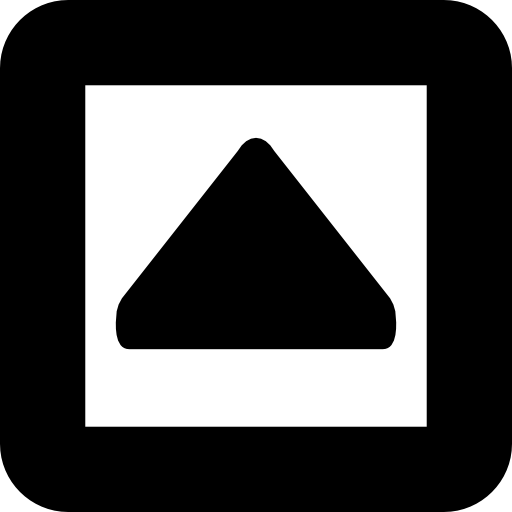 - `<Icon group="coolicons" name="up-arrow-triangle-in-a-square-gross-outline" />`
 -  - `<Icon group="coolicons" name="up-arrow-triangle" />`
 -  - `<Icon group="coolicons" name="up-arrow" />`
 -  - `<Icon group="coolicons" name="up-arrows-angles-couple" />`
 -  - `<Icon group="coolicons" name="up-level-arrow" />`
 -  - `<Icon group="coolicons" name="up-long-arrow" />`
 - 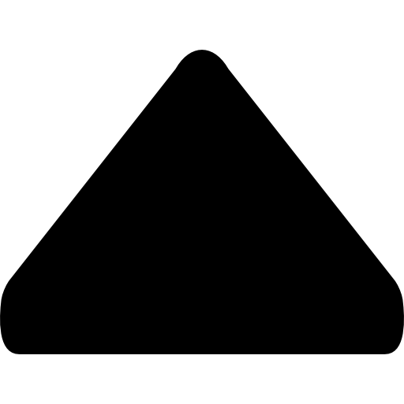 - `<Icon group="coolicons" name="up-triangular-arrow" />`
 -  - `<Icon group="coolicons" name="upload-to-the-cloud-interface-symbol" />`
 - 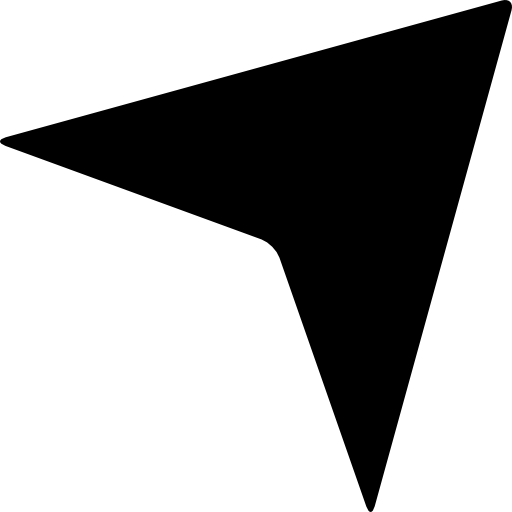 - `<Icon group="coolicons" name="upper-right-arrow-black-symbol" />`
 -  - `<Icon group="coolicons" name="user-black-shape" />`
 -  - `<Icon group="coolicons" name="user-image-on-phone-screen-in-horizontal-position" />`
 -  - `<Icon group="coolicons" name="verification-sign-in-a-circle" />`
 -  - `<Icon group="coolicons" name="verification-symbol-in-a-square-box" />`
 -  - `<Icon group="coolicons" name="verification-symbol" />`
 -  - `<Icon group="coolicons" name="verify" />`
 -  - `<Icon group="coolicons" name="video-camera" />`
 - 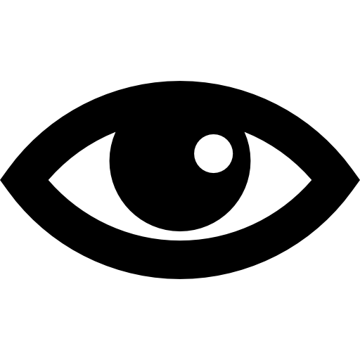 - `<Icon group="coolicons" name="view-eye-interface-symbol" />`
 -  - `<Icon group="coolicons" name="vimeo-letter-logo-in-a-square" />`
 -  - `<Icon group="coolicons" name="vk-logo-of-social-network" />`
 - 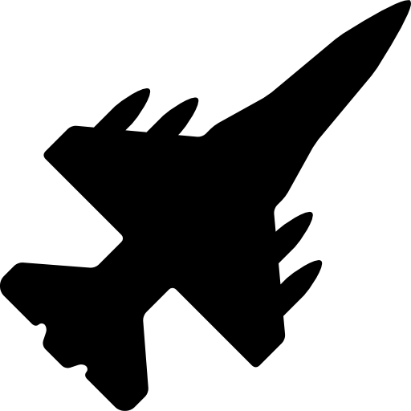 - `<Icon group="coolicons" name="war-airplane-bottom-view-black-shape" />`
 - 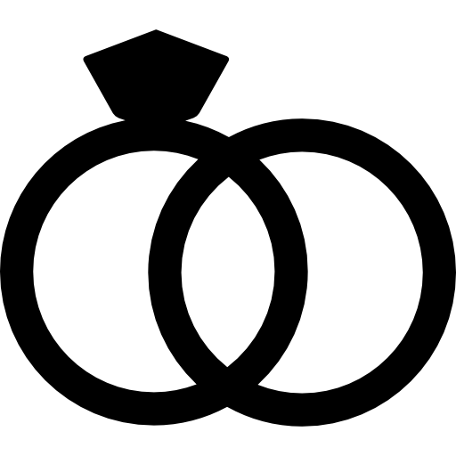 - `<Icon group="coolicons" name="wedding-rings-couple" />`
 -  - `<Icon group="coolicons" name="weekly-calendar-variant" />`
 - 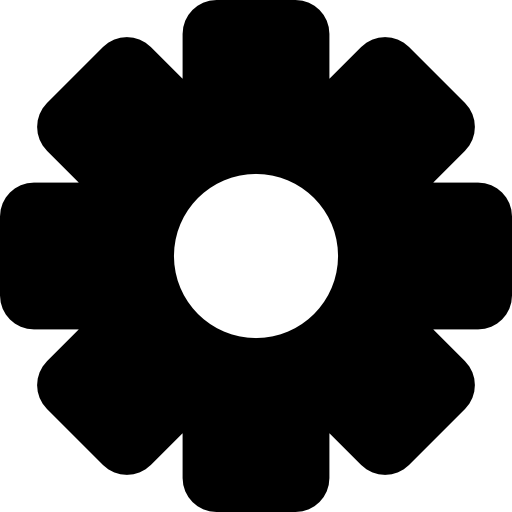 - `<Icon group="coolicons" name="wheel-shape-variant" />`
 - 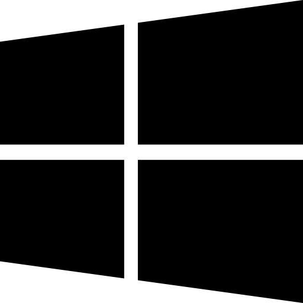 - `<Icon group="coolicons" name="windows-logo" />`
 -  - `<Icon group="coolicons" name="wireless-keyboard" />`
 -  - `<Icon group="coolicons" name="wireless-signal-interface-status-symbol-of-bars-group" />`
 -  - `<Icon group="coolicons" name="world-ball" />`
 -  - `<Icon group="coolicons" name="wrench-black-silhouette-of-tool" />`
 - 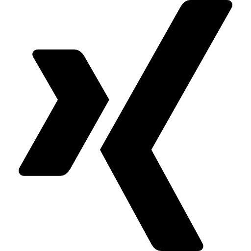 - `<Icon group="coolicons" name="xing-logo-1" />`
 -  - `<Icon group="coolicons" name="xing-logo" />`
 -  - `<Icon group="coolicons" name="yen-symbol" />`
 -  - `<Icon group="coolicons" name="youtube-logo" />`
 -  - `<Icon group="coolicons" name="youtube-rounded-square-logo" />`