## universalicons

 -  - `<Icon group="universalicons" name="angry-face-of-square-shape-and-straight-lines" />`
 -  - `<Icon group="universalicons" name="angry-face-of-square-shape-outline" />`
 -  - `<Icon group="universalicons" name="angry-face" />`
 -  - `<Icon group="universalicons" name="arrow-pointing-to-left" />`
 - 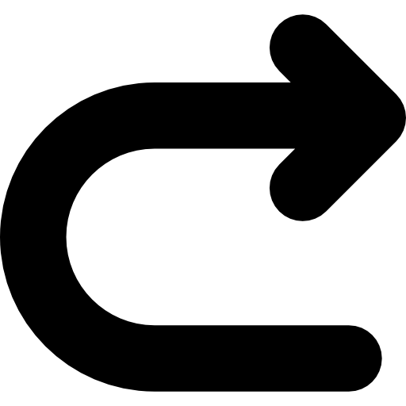 - `<Icon group="universalicons" name="arrow-turning-to-right" />`
 - 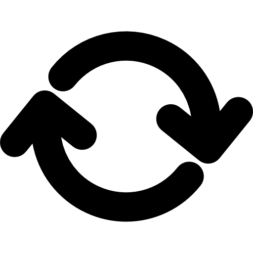 - `<Icon group="universalicons" name="arrows-circle" />`
 -  - `<Icon group="universalicons" name="audio-headset-tool" />`
 -  - `<Icon group="universalicons" name="bad-face" />`
 -  - `<Icon group="universalicons" name="bars-graphic-1" />`
 -  - `<Icon group="universalicons" name="bars-graphic" />`
 - 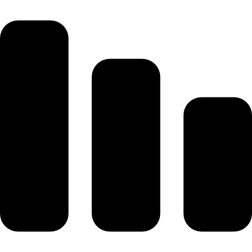 - `<Icon group="universalicons" name="bars-symbol" />`
 - 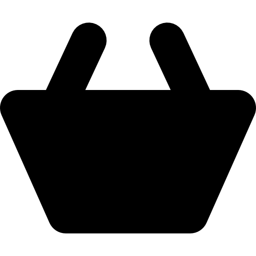 - `<Icon group="universalicons" name="basket-black-shape" />`
 - 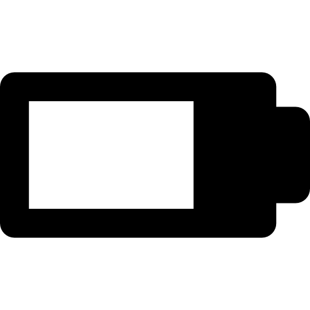 - `<Icon group="universalicons" name="battery-almost-full" />`
 - 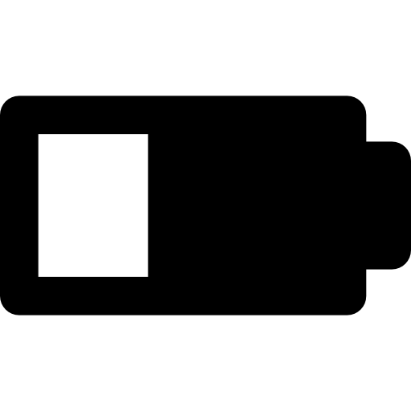 - `<Icon group="universalicons" name="battery-status-sign-with-less-than-half-energy-charge" />`
 - 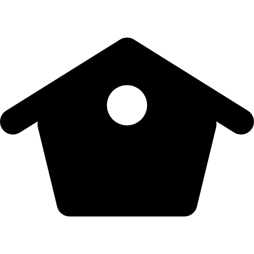 - `<Icon group="universalicons" name="birds-home" />`
 - 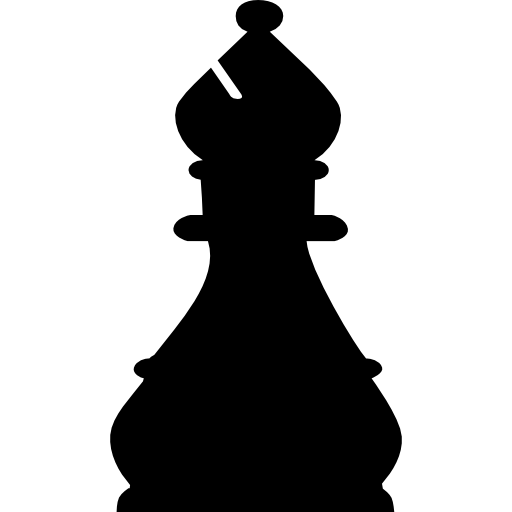 - `<Icon group="universalicons" name="bishop-chess-piece" />`
 -  - `<Icon group="universalicons" name="black-folder-shape-for-interface" />`
 - 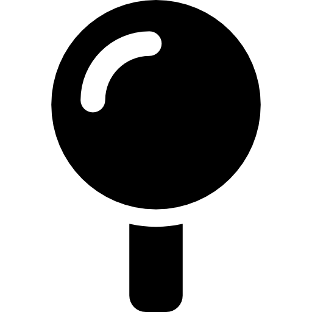 - `<Icon group="universalicons" name="black-golf-ball" />`
 -  - `<Icon group="universalicons" name="black-hand-pointing-to-right" />`
 -  - `<Icon group="universalicons" name="black-hand-pointing-up" />`
 -  - `<Icon group="universalicons" name="black-heart-love-symbol" />`
 - 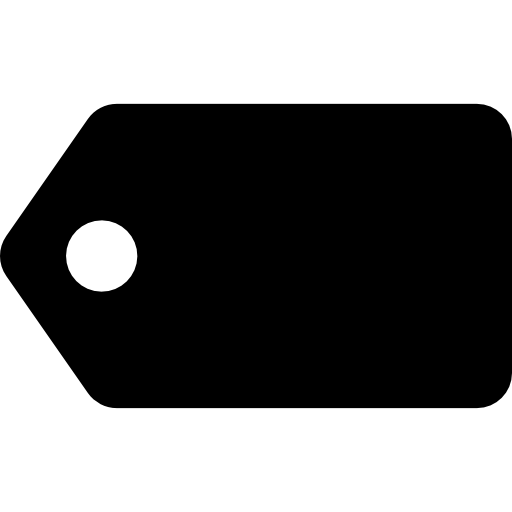 - `<Icon group="universalicons" name="black-label-in-horizontal-position" />`
 -  - `<Icon group="universalicons" name="black-male-user-symbol" />`
 -  - `<Icon group="universalicons" name="black-open-envelope-back" />`
 - 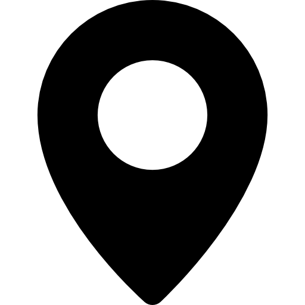 - `<Icon group="universalicons" name="black-placeholder-variant" />`
 -  - `<Icon group="universalicons" name="black-suitcase" />`
 -  - `<Icon group="universalicons" name="black-triangular-arrowhead-pointing-to-left-direction" />`
 -  - `<Icon group="universalicons" name="blind-face" />`
 - 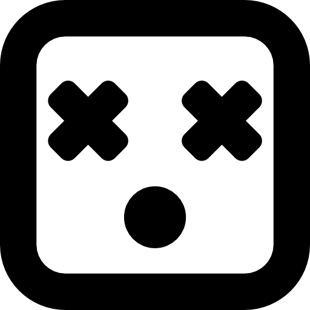 - `<Icon group="universalicons" name="blind-square-face" />`
 - 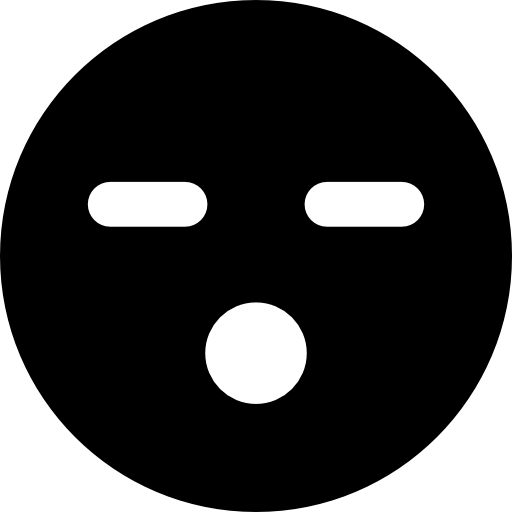 - `<Icon group="universalicons" name="boring-face" />`
 - 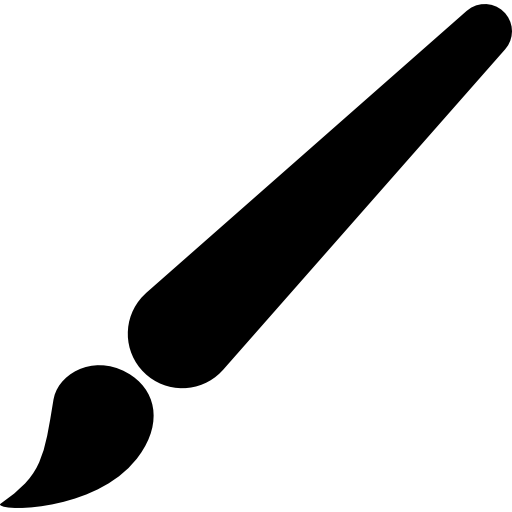 - `<Icon group="universalicons" name="brush-tool" />`
 -  - `<Icon group="universalicons" name="bubbles-interface-symbol-for-talk" />`
 - 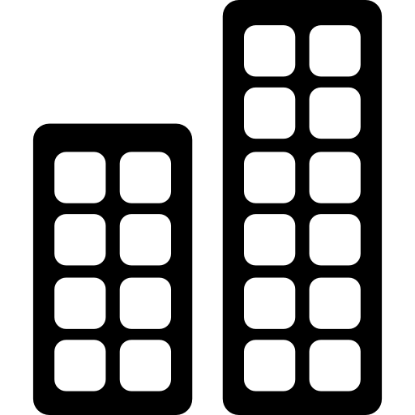 - `<Icon group="universalicons" name="buildings" />`
 -  - `<Icon group="universalicons" name="calculator" />`
 -  - `<Icon group="universalicons" name="calendar-page-symbol-on-day-15" />`
 -  - `<Icon group="universalicons" name="calling-out-symbol-of-auricular-with-arrow" />`
 -  - `<Icon group="universalicons" name="camera-to-take-photos" />`
 - 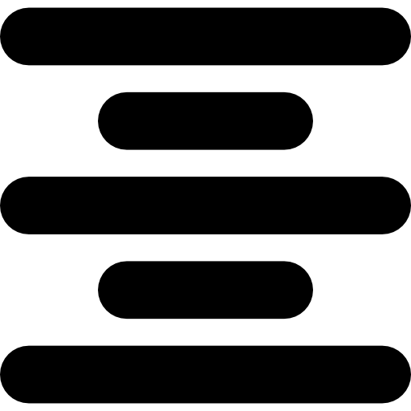 - `<Icon group="universalicons" name="centered-paragraph-text-lines-symbol-for-interface" />`
 -  - `<Icon group="universalicons" name="check-document-interface-square-symbol" />`
 -  - `<Icon group="universalicons" name="check-mark-in-a-circle" />`
 -  - `<Icon group="universalicons" name="check-sign" />`
 -  - `<Icon group="universalicons" name="checked-page-symbol" />`
 - 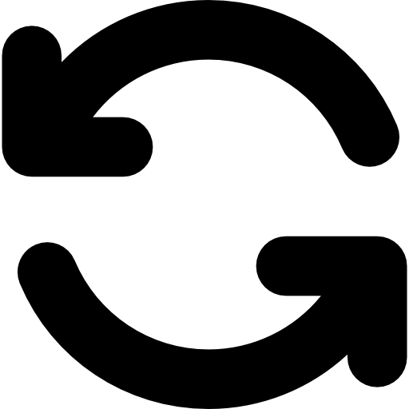 - `<Icon group="universalicons" name="circle-of-arrows-couple" />`
 -  - `<Icon group="universalicons" name="circular-clock-symbol-for-interface" />`
 - 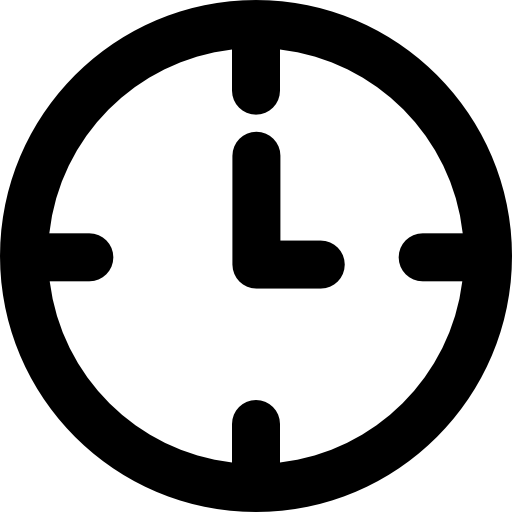 - `<Icon group="universalicons" name="clock-circular-tool-shape" />`
 -  - `<Icon group="universalicons" name="close-hanging-signal-for-commerce" />`
 -  - `<Icon group="universalicons" name="cloud-black-shape-with-a-cross" />`
 -  - `<Icon group="universalicons" name="cloud-black-shape-with-three-dots-inside" />`
 -  - `<Icon group="universalicons" name="cloud-lock" />`
 -  - `<Icon group="universalicons" name="cloud-with-check-sign" />`
 - 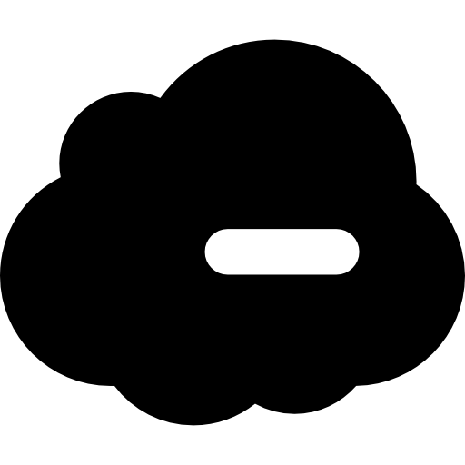 - `<Icon group="universalicons" name="cloud-with-minus-sign" />`
 - 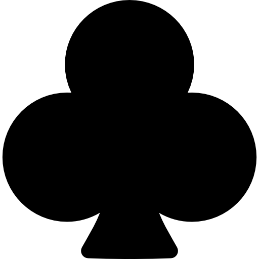 - `<Icon group="universalicons" name="clover-black-shape" />`
 - 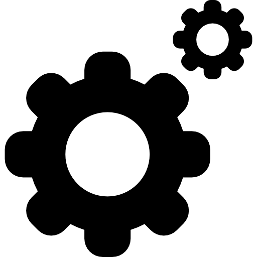 - `<Icon group="universalicons" name="cogs-on-wheels-interface-symbol-for-settings-edition-button" />`
 -  - `<Icon group="universalicons" name="cogwheel" />`
 - 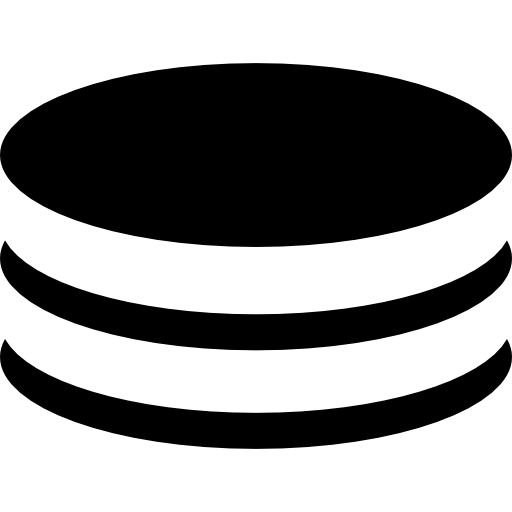 - `<Icon group="universalicons" name="coins-stack" />`
 -  - `<Icon group="universalicons" name="color-palette-for-painter" />`
 - 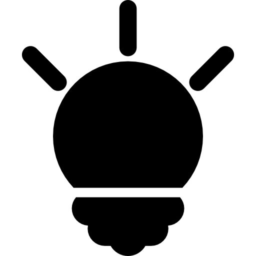 - `<Icon group="universalicons" name="creative-lightbulb-symbol-black-shape" />`
 - 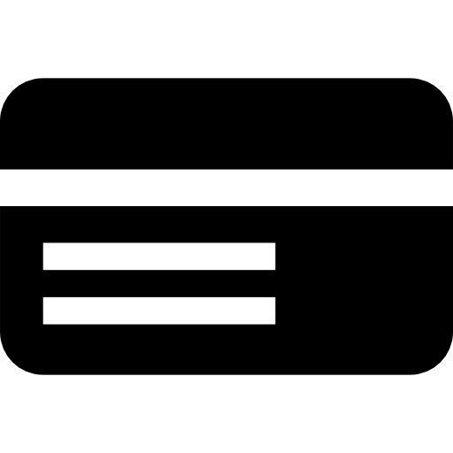 - `<Icon group="universalicons" name="credit-card-tool" />`
 -  - `<Icon group="universalicons" name="cross-delete-or-close-circular-button-interface-symbol" />`
 - 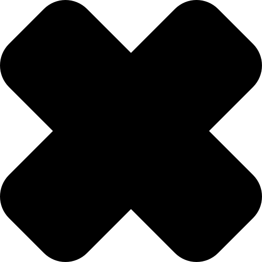 - `<Icon group="universalicons" name="cross-gross-symbol" />`
 -  - `<Icon group="universalicons" name="cross-in-a-circle" />`
 - 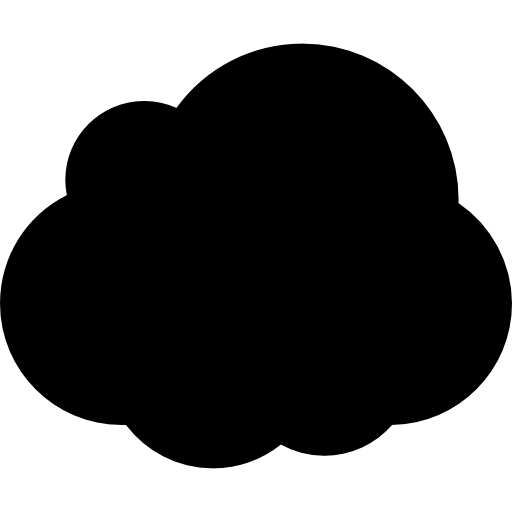 - `<Icon group="universalicons" name="dark-cloud-shape" />`
 - 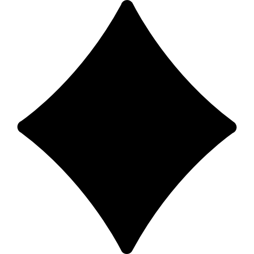 - `<Icon group="universalicons" name="diamond-symbol" />`
 -  - `<Icon group="universalicons" name="dice-with-five-dots" />`
 - 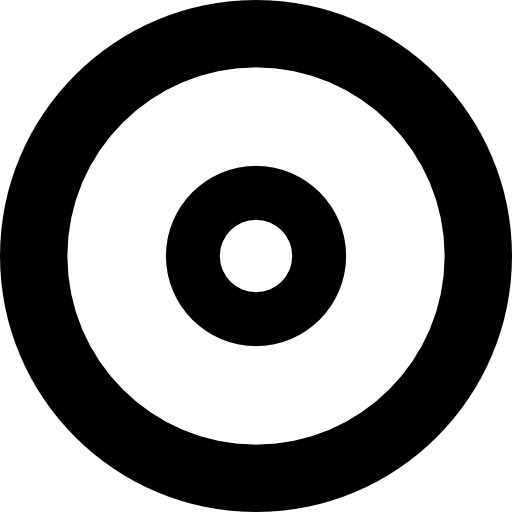 - `<Icon group="universalicons" name="disc-outline-of-gross-line" />`
 - 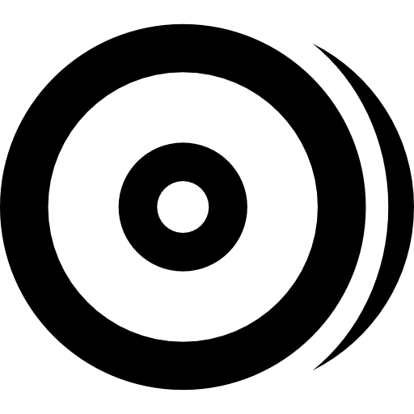 - `<Icon group="universalicons" name="discs" />`
 -  - `<Icon group="universalicons" name="doctor-suitcase-with-a-cross" />`
 -  - `<Icon group="universalicons" name="document-lock-interface-security-symbol" />`
 -  - `<Icon group="universalicons" name="document-lock-symbol" />`
 -  - `<Icon group="universalicons" name="document-rounded-square-interface-symbol-with-text-lines" />`
 -  - `<Icon group="universalicons" name="document-with-minus-sign" />`
 -  - `<Icon group="universalicons" name="documents-check-interface-symbol-of-text-lines-in-rounded-square" />`
 -  - `<Icon group="universalicons" name="documents-plus-symbol-for-interface-with-rounded-square-shape" />`
 -  - `<Icon group="universalicons" name="documents-rounded-square-symbol" />`
 -  - `<Icon group="universalicons" name="dollar-coin-symbol" />`
 -  - `<Icon group="universalicons" name="dollar-coin" />`
 -  - `<Icon group="universalicons" name="dollar-sign" />`
 - 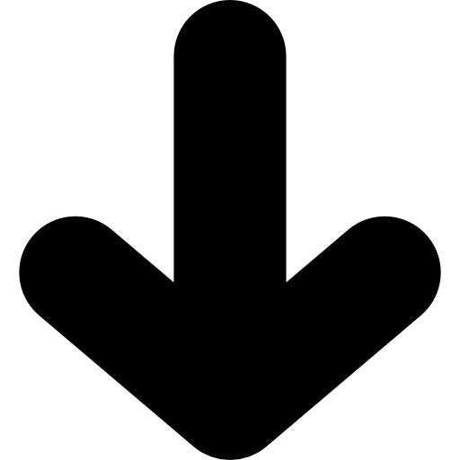 - `<Icon group="universalicons" name="down-arrow-1" />`
 -  - `<Icon group="universalicons" name="down-arrow-in-a-circle" />`
 -  - `<Icon group="universalicons" name="down-arrow" />`
 -  - `<Icon group="universalicons" name="down-arrowhead-in-a-circle" />`
 -  - `<Icon group="universalicons" name="down-arrows" />`
 -  - `<Icon group="universalicons" name="down-double-arrow" />`
 -  - `<Icon group="universalicons" name="download-symbol" />`
 -  - `<Icon group="universalicons" name="emoticon-in-love-of-square-face-shape" />`
 - 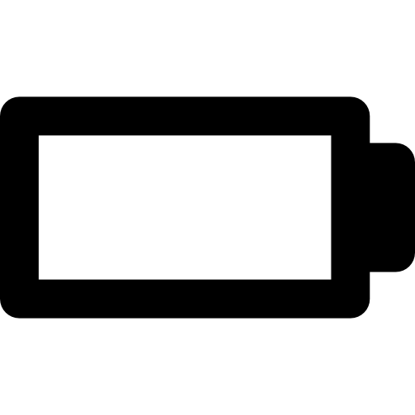 - `<Icon group="universalicons" name="empty-battery-interface-status-symbol" />`
 - 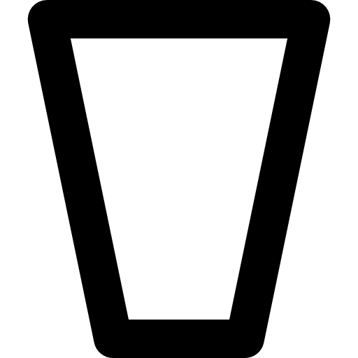 - `<Icon group="universalicons" name="empty-glass-outline" />`
 - 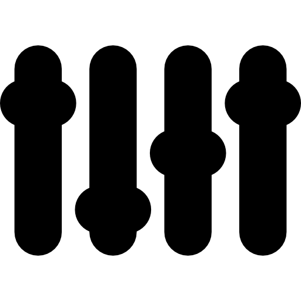 - `<Icon group="universalicons" name="equalizer" />`
 -  - `<Icon group="universalicons" name="euro-coin" />`
 -  - `<Icon group="universalicons" name="euro-sign-in-a-circle" />`
 -  - `<Icon group="universalicons" name="euro" />`
 - 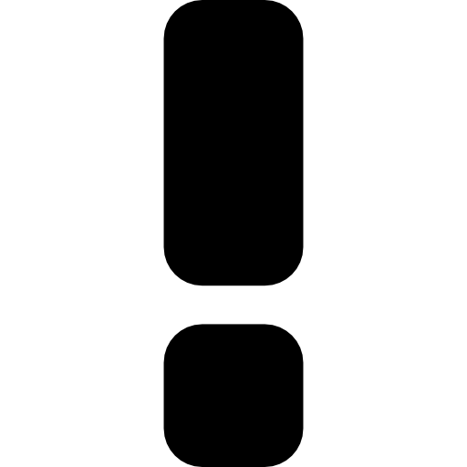 - `<Icon group="universalicons" name="exclamation-sign-warning-interface-symbol" />`
 - 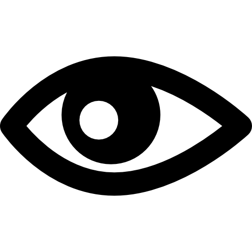 - `<Icon group="universalicons" name="eye-shape-variant-interface-view-symbol" />`
 - 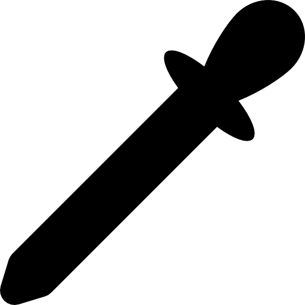 - `<Icon group="universalicons" name="eyedropper-black-tool-silhouette" />`
 - 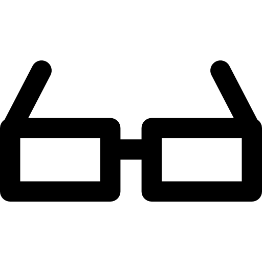 - `<Icon group="universalicons" name="eyeglass-of-rectangular-shape" />`
 - 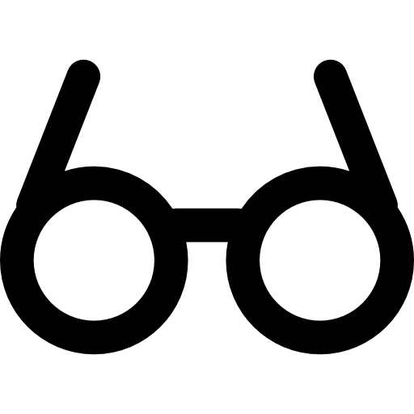 - `<Icon group="universalicons" name="eyeglasses-of-circular-shape" />`
 -  - `<Icon group="universalicons" name="face-of-silence-with-a-cross-as-mouth" />`
 -  - `<Icon group="universalicons" name="facebook-logo-in-circular-shape" />`
 -  - `<Icon group="universalicons" name="facebook-logo" />`
 - 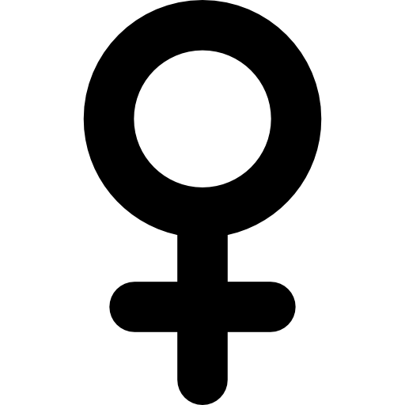 - `<Icon group="universalicons" name="female-symbol" />`
 - 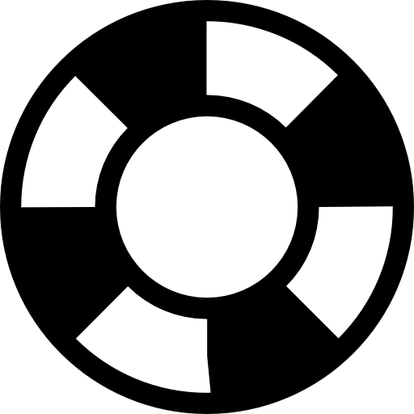 - `<Icon group="universalicons" name="floating-tool-to-save-lives" />`
 -  - `<Icon group="universalicons" name="folder-check-symbol" />`
 - 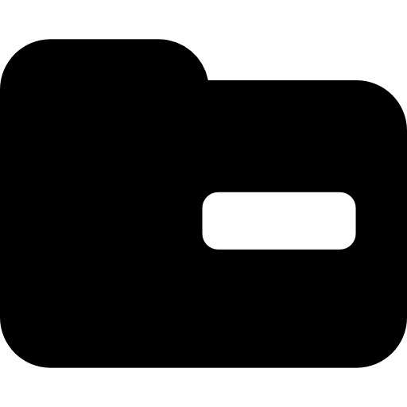 - `<Icon group="universalicons" name="folder-with-minus-sign-interface-symbol" />`
 -  - `<Icon group="universalicons" name="folder-with-plus-sign-for-interface-button-to-add" />`
 - 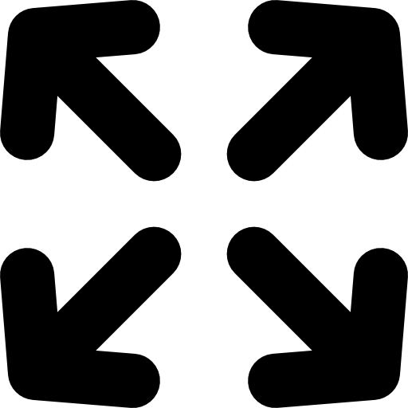 - `<Icon group="universalicons" name="four-arrows-interface-symbol-to-maximize-size" />`
 - 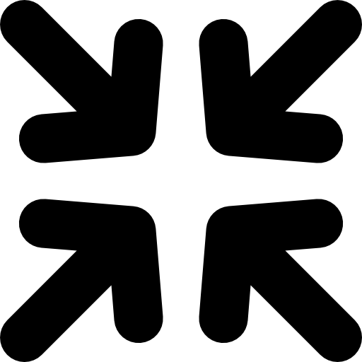 - `<Icon group="universalicons" name="four-arrows-pointing-center-interface-symbol-to-minimize" />`
 -  - `<Icon group="universalicons" name="free-tag-for-commerce" />`
 -  - `<Icon group="universalicons" name="frown-face" />`
 - 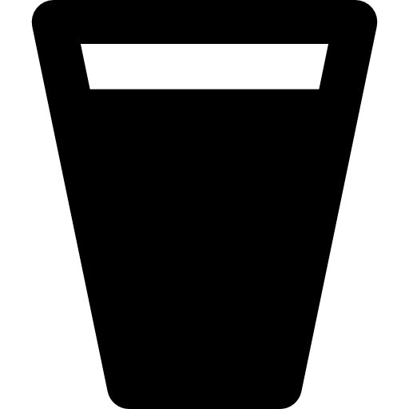 - `<Icon group="universalicons" name="glass-full-of-liquid" />`
 - 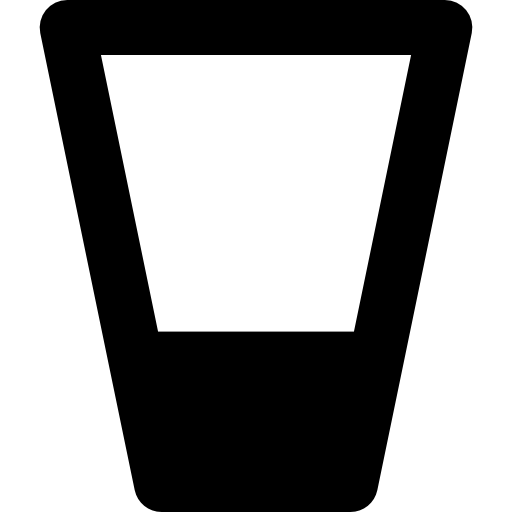 - `<Icon group="universalicons" name="glass" />`
 -  - `<Icon group="universalicons" name="global-interface-symbol-of-earth-grid" />`
 -  - `<Icon group="universalicons" name="graphic-page-symbol" />`
 -  - `<Icon group="universalicons" name="graphic-page" />`
 - 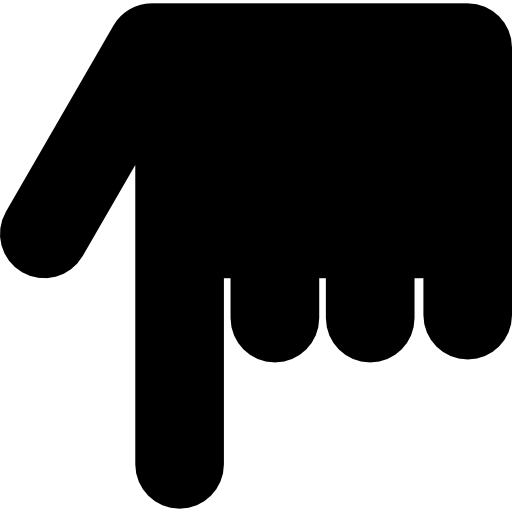 - `<Icon group="universalicons" name="hand-pointing-down" />`
 -  - `<Icon group="universalicons" name="hand-pointing-to-left-direction" />`
 - 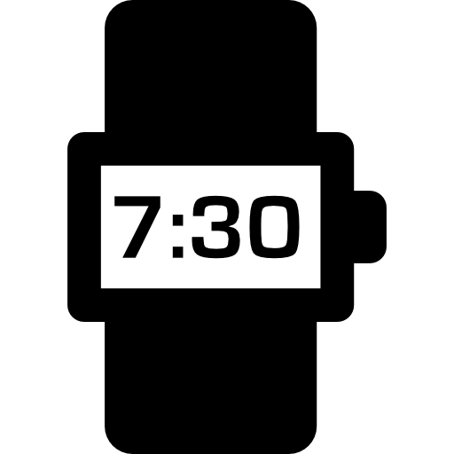 - `<Icon group="universalicons" name="hand-watch" />`
 -  - `<Icon group="universalicons" name="happy-face" />`
 -  - `<Icon group="universalicons" name="hd" />`
 -  - `<Icon group="universalicons" name="heart-black-shape-symbol" />`
 -  - `<Icon group="universalicons" name="hearts" />`
 - 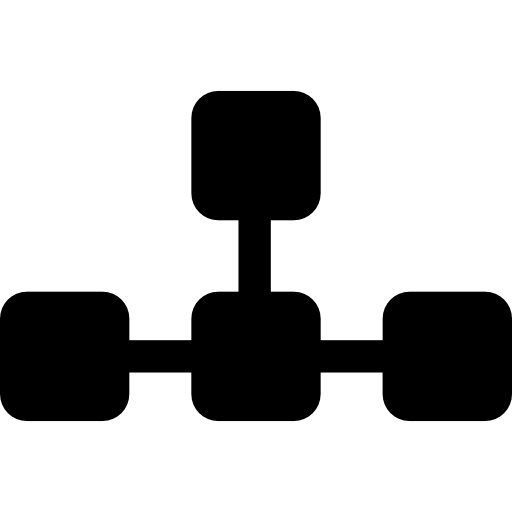 - `<Icon group="universalicons" name="hierarchical-network" />`
 - 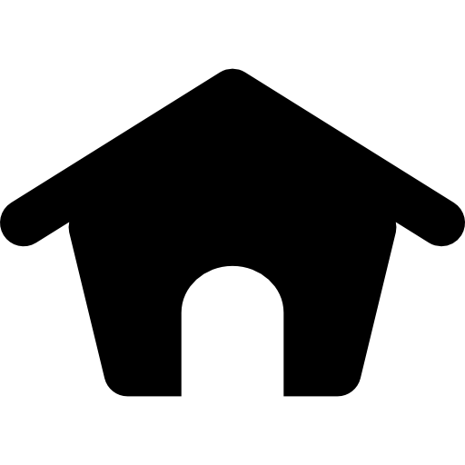 - `<Icon group="universalicons" name="home-black-shape" />`
 - 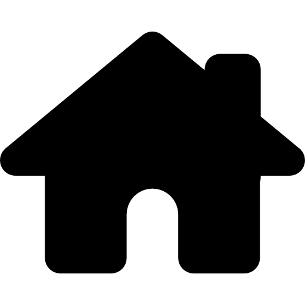 - `<Icon group="universalicons" name="home-black-silhouette" />`
 - 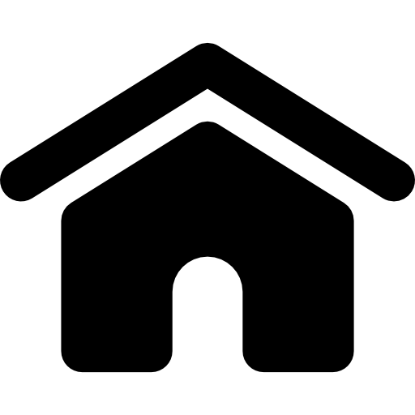 - `<Icon group="universalicons" name="home-building-symbol-variant" />`
 - 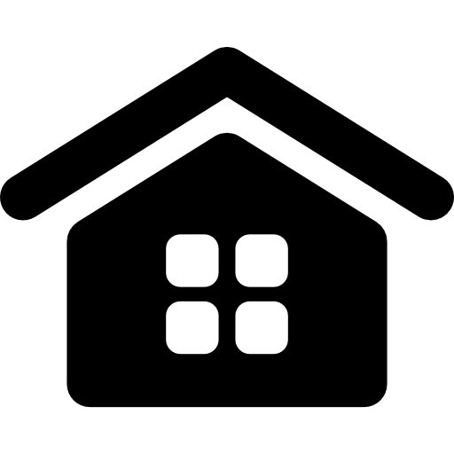 - `<Icon group="universalicons" name="home-interface-symbol-with-a-window-of-squares" />`
 -  - `<Icon group="universalicons" name="home-sign" />`
 - 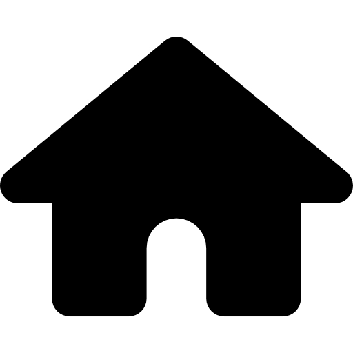 - `<Icon group="universalicons" name="home" />`
 - 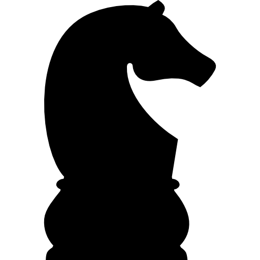 - `<Icon group="universalicons" name="horse-black-chess-piece-shape-from-side-view" />`
 -  - `<Icon group="universalicons" name="hot-drink-mug" />`
 -  - `<Icon group="universalicons" name="house-black-shape-for-home-interface-symbol" />`
 - 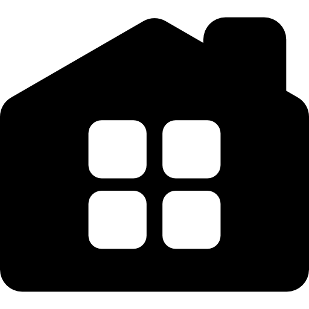 - `<Icon group="universalicons" name="house" />`
 -  - `<Icon group="universalicons" name="id-card-interface-symbol" />`
 -  - `<Icon group="universalicons" name="image-interface-symbol-with-a-landscape" />`
 -  - `<Icon group="universalicons" name="images-interface-symbol" />`
 -  - `<Icon group="universalicons" name="incoming-call-interface-symbol-with-telephone-auricular-and-left-arrow-pointing-to-it" />`
 - 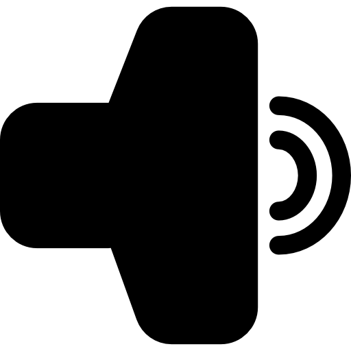 - `<Icon group="universalicons" name="increase-volume-speaker-interface-symbol" />`
 -  - `<Icon group="universalicons" name="info-circular-interface-symbol" />`
 - 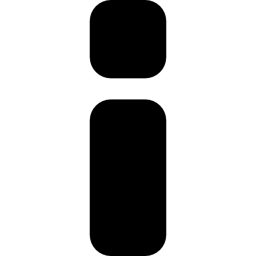 - `<Icon group="universalicons" name="information-interface-letter-symbol" />`
 - 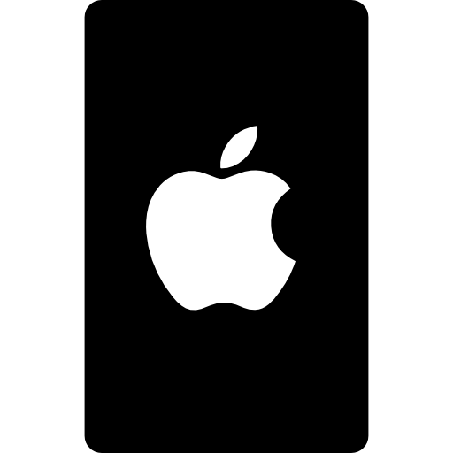 - `<Icon group="universalicons" name="iphone" />`
 -  - `<Icon group="universalicons" name="joystick-games-control-tool" />`
 -  - `<Icon group="universalicons" name="jpg-picture-square-symbol-for-interface" />`
 - 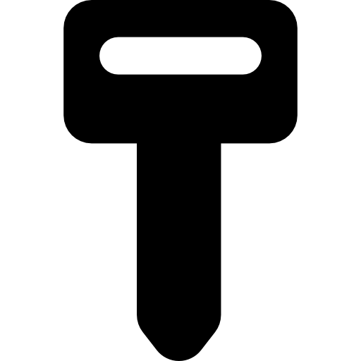 - `<Icon group="universalicons" name="key-in-vertical-position-for-interface-security-symbol" />`
 - 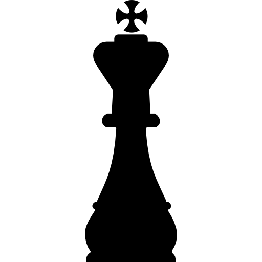 - `<Icon group="universalicons" name="king-chess-piece-shape" />`
 - 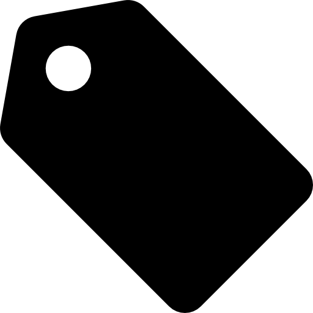 - `<Icon group="universalicons" name="label-black-shape-rotated-to-left" />`
 - 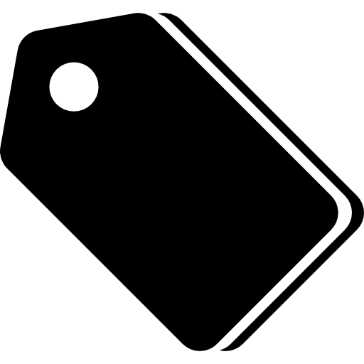 - `<Icon group="universalicons" name="label" />`
 -  - `<Icon group="universalicons" name="laptop" />`
 -  - `<Icon group="universalicons" name="left-arrow-symbol-in-a-circle" />`
 -  - `<Icon group="universalicons" name="left-arrowhead-in-a-circle" />`
 -  - `<Icon group="universalicons" name="left-arrowhead" />`
 -  - `<Icon group="universalicons" name="left-arrowheads-couple" />`
 -  - `<Icon group="universalicons" name="left-arrowheads-triangles" />`
 -  - `<Icon group="universalicons" name="left-arrows" />`
 - 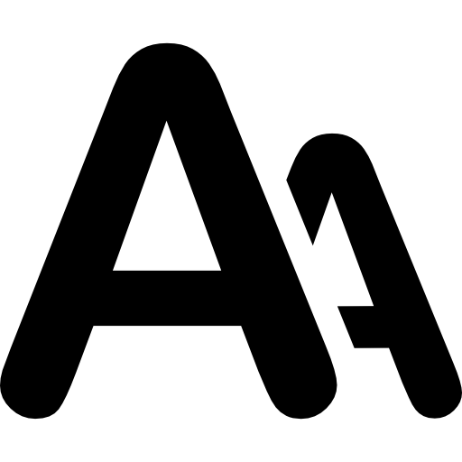 - `<Icon group="universalicons" name="letter-type-interface-symbol" />`
 -  - `<Icon group="universalicons" name="lifeline-signal" />`
 - 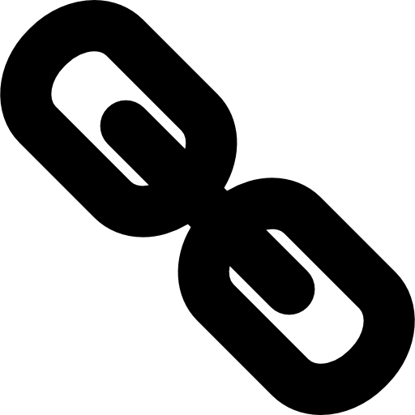 - `<Icon group="universalicons" name="link-interface-symbol" />`
 - 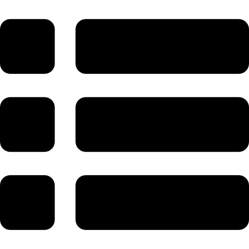 - `<Icon group="universalicons" name="list-interface-symbol" />`
 -  - `<Icon group="universalicons" name="lock-a-folder-interface-symbol" />`
 -  - `<Icon group="universalicons" name="lock-page-interface-symbol" />`
 -  - `<Icon group="universalicons" name="lock-rectangular-padlock-shape" />`
 -  - `<Icon group="universalicons" name="locked-open-folder-interface-symbol" />`
 -  - `<Icon group="universalicons" name="magnifying-glass-on-bars-graphic" />`
 -  - `<Icon group="universalicons" name="magnifying-glass-with-minus-sign" />`
 -  - `<Icon group="universalicons" name="magnifying-glass" />`
 -  - `<Icon group="universalicons" name="male-symbol" />`
 -  - `<Icon group="universalicons" name="males-group" />`
 -  - `<Icon group="universalicons" name="man-shape" />`
 -  - `<Icon group="universalicons" name="map-folded-paper" />`
 -  - `<Icon group="universalicons" name="marketing-viral" />`
 - 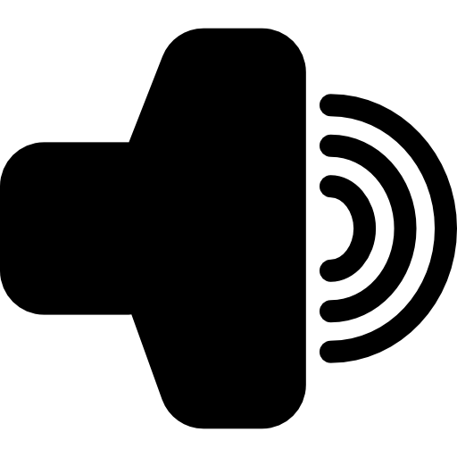 - `<Icon group="universalicons" name="maximal-volume-audio-interface-symbol-of-a-speaker-side-view-with-lines-representing-sound" />`
 -  - `<Icon group="universalicons" name="minus-pages-sign" />`
 - 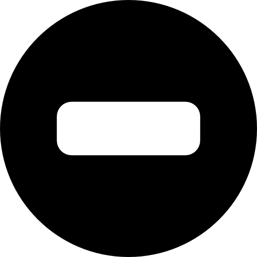 - `<Icon group="universalicons" name="minus-sign-in-a-circle" />`
 - 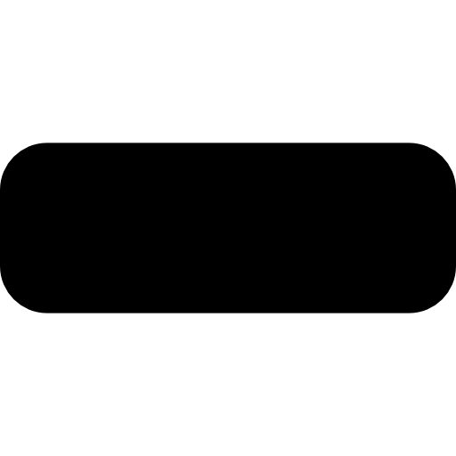 - `<Icon group="universalicons" name="minus-sign-of-horizontal-bar" />`
 -  - `<Icon group="universalicons" name="money-eyes-on-square-face" />`
 -  - `<Icon group="universalicons" name="money-face" />`
 -  - `<Icon group="universalicons" name="monitor-tool-symbol" />`
 -  - `<Icon group="universalicons" name="monitor-with-stats-graphic" />`
 -  - `<Icon group="universalicons" name="monthly-calendar" />`
 -  - `<Icon group="universalicons" name="movie-camera-interface-symbol-with-play-triangle" />`
 -  - `<Icon group="universalicons" name="movie-camera-silhouette" />`
 -  - `<Icon group="universalicons" name="movie-camera" />`
 -  - `<Icon group="universalicons" name="movie-film-reel" />`
 -  - `<Icon group="universalicons" name="movie-interface-symbol" />`
 -  - `<Icon group="universalicons" name="movie-photogram" />`
 -  - `<Icon group="universalicons" name="movie-square-sign" />`
 -  - `<Icon group="universalicons" name="music-note" />`
 -  - `<Icon group="universalicons" name="music-square-symbol" />`
 -  - `<Icon group="universalicons" name="musical-note-symbol-1" />`
 -  - `<Icon group="universalicons" name="musical-note-symbol" />`
 -  - `<Icon group="universalicons" name="musical-note-with-song-name-lines" />`
 -  - `<Icon group="universalicons" name="musical-notes-sign" />`
 - 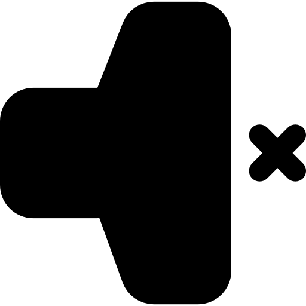 - `<Icon group="universalicons" name="mute-interface-audio-symbol-of-a-speaker-with-a-cross" />`
 -  - `<Icon group="universalicons" name="navigate-to-end-right-arrow-symbol-with-vertical-bar" />`
 -  - `<Icon group="universalicons" name="navigate-to-start-letter-k-sign" />`
 -  - `<Icon group="universalicons" name="network-connection" />`
 -  - `<Icon group="universalicons" name="new-tag" />`
 -  - `<Icon group="universalicons" name="news-interface-symbol" />`
 - 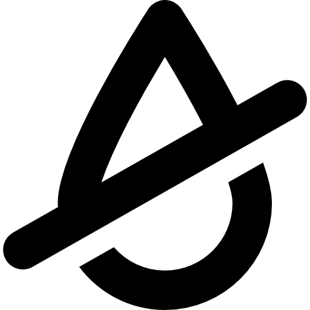 - `<Icon group="universalicons" name="no-water-symbol-od-a-drop-with-a-slash" />`
 -  - `<Icon group="universalicons" name="open-black-folder-interface-symbol" />`
 - 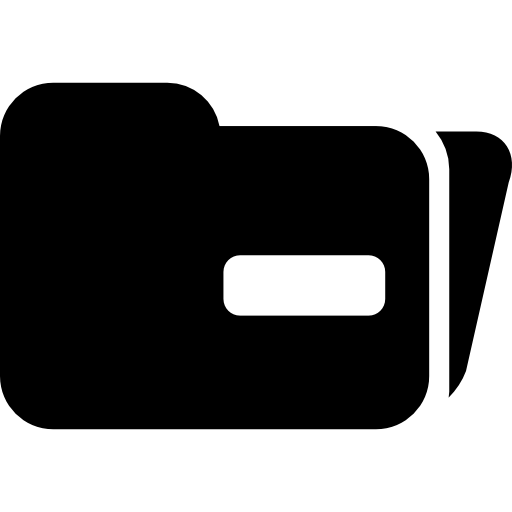 - `<Icon group="universalicons" name="open-folder-with-minus-sign" />`
 -  - `<Icon group="universalicons" name="open-folder-with-plus-sign" />`
 -  - `<Icon group="universalicons" name="open-folder-with-verification-sign" />`
 -  - `<Icon group="universalicons" name="open-hanging-signal" />`
 -  - `<Icon group="universalicons" name="opened-back-envelope-with-down-arrow" />`
 -  - `<Icon group="universalicons" name="opened-envelope-back-with-up-arrow" />`
 -  - `<Icon group="universalicons" name="oval-black-speech-bubble" />`
 -  - `<Icon group="universalicons" name="page-code-symbol" />`
 - 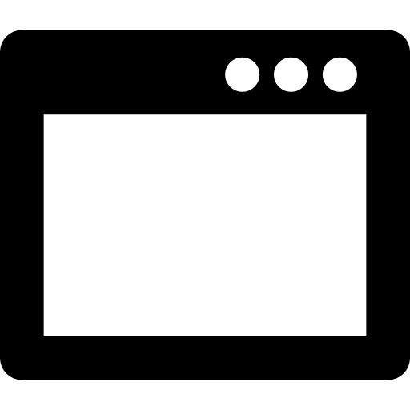 - `<Icon group="universalicons" name="page-interface-symbol" />`
 -  - `<Icon group="universalicons" name="page-symbol-1" />`
 -  - `<Icon group="universalicons" name="page-symbol" />`
 -  - `<Icon group="universalicons" name="pages-interface-symbol-of-black-squares" />`
 - 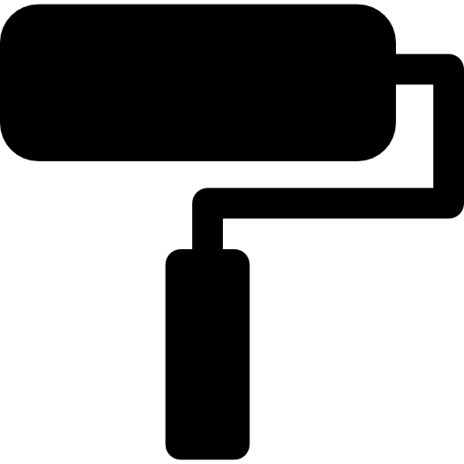 - `<Icon group="universalicons" name="paint-roller-silhouette" />`
 - 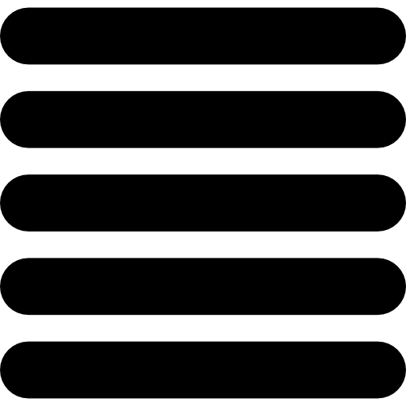 - `<Icon group="universalicons" name="paragraph-justified-option-symbol-for-interface-of-five-parallel-horizontal-lines" />`
 - 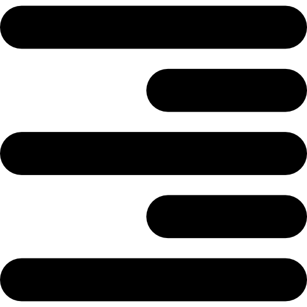 - `<Icon group="universalicons" name="paragraph-left-alignment-interface-symbol" />`
 -  - `<Icon group="universalicons" name="paragraph-left-alignment-symbol-for-interface" />`
 - 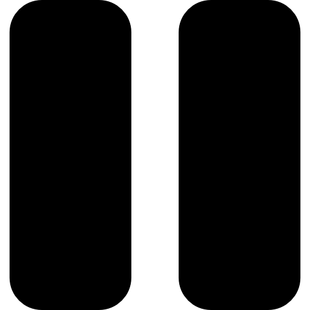 - `<Icon group="universalicons" name="pause-symbol" />`
 - 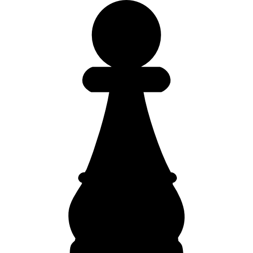 - `<Icon group="universalicons" name="pawn-black-silhouette" />`
 -  - `<Icon group="universalicons" name="peace-symbol" />`
 -  - `<Icon group="universalicons" name="pen-feather-black-diagonal-shape-of-a-bird-wing" />`
 -  - `<Icon group="universalicons" name="pen-point" />`
 -  - `<Icon group="universalicons" name="pen-tool-on-diagonal-position" />`
 -  - `<Icon group="universalicons" name="pencil-in-diagonal-position-black-symbol-for-interface" />`
 -  - `<Icon group="universalicons" name="pencil-on-a-square-outline" />`
 -  - `<Icon group="universalicons" name="pencil-tool-symbol-in-diagonal-position-for-interface" />`
 -  - `<Icon group="universalicons" name="pencil-write-interface-symbol" />`
 -  - `<Icon group="universalicons" name="percentage-symbol" />`
 -  - `<Icon group="universalicons" name="phone-auricular-symbol" />`
 - 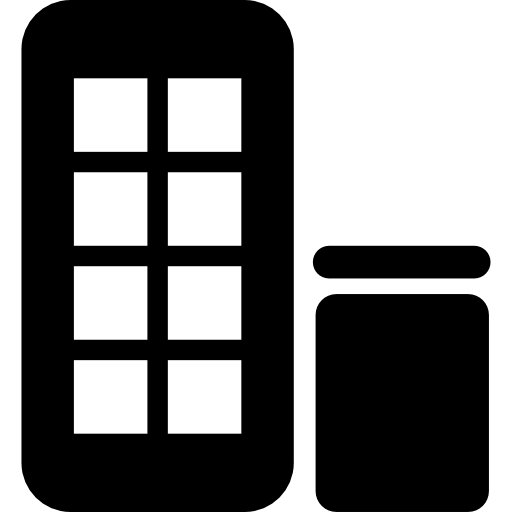 - `<Icon group="universalicons" name="phone-cabin-or-small-building-and-a-trash-can" />`
 - 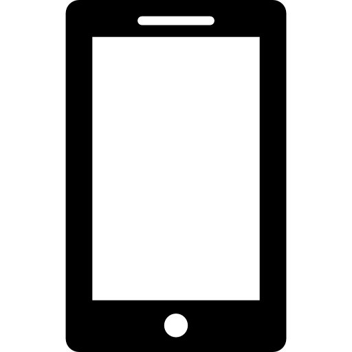 - `<Icon group="universalicons" name="phone-digital-communication-tool" />`
 -  - `<Icon group="universalicons" name="photo-camera-interface-symbol-for-button" />`
 - 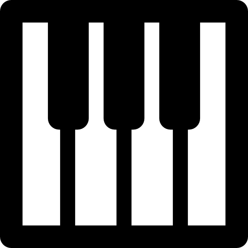 - `<Icon group="universalicons" name="piano-square-symbol" />`
 -  - `<Icon group="universalicons" name="pie-graphic-symbol-for-business-stats" />`
 -  - `<Icon group="universalicons" name="pie-graphic" />`
 - 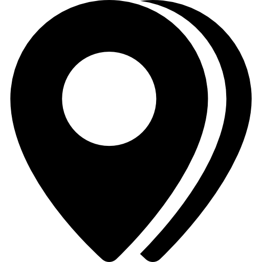 - `<Icon group="universalicons" name="placeholders" />`
 -  - `<Icon group="universalicons" name="planet-earth-1" />`
 -  - `<Icon group="universalicons" name="planet-earth-grid-symbol" />`
 -  - `<Icon group="universalicons" name="planet-earth" />`
 - 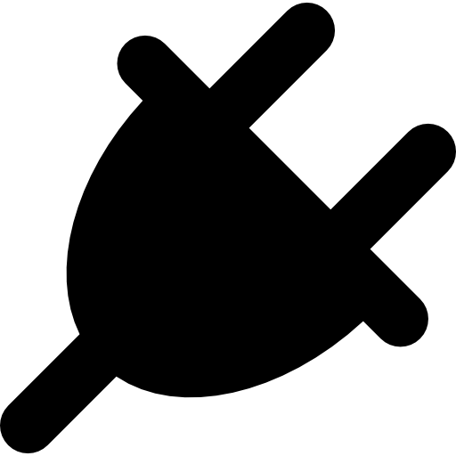 - `<Icon group="universalicons" name="plug" />`
 -  - `<Icon group="universalicons" name="plus-page-interface-add-symbol" />`
 -  - `<Icon group="universalicons" name="plus-sign-in-a-dark-cloud-internet-symbol" />`
 -  - `<Icon group="universalicons" name="plus-sign" />`
 -  - `<Icon group="universalicons" name="plus-zoom-magnifying-glass-interface-symbol" />`
 -  - `<Icon group="universalicons" name="pound-coin" />`
 - 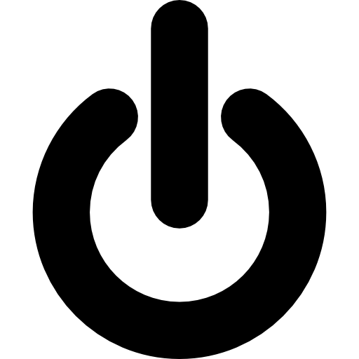 - `<Icon group="universalicons" name="power" />`
 -  - `<Icon group="universalicons" name="queen-chess-piece-black-shape" />`
 -  - `<Icon group="universalicons" name="redo-arrow-symbol" />`
 -  - `<Icon group="universalicons" name="rent-hanging-signal" />`
 -  - `<Icon group="universalicons" name="retro-photo-camera-symbol-of-square-shape" />`
 -  - `<Icon group="universalicons" name="right-arrow-in-a-circle" />`
 -  - `<Icon group="universalicons" name="right-arrow" />`
 -  - `<Icon group="universalicons" name="right-arrowhead-black-triangular-shape" />`
 -  - `<Icon group="universalicons" name="right-arrowhead-in-a-circle" />`
 -  - `<Icon group="universalicons" name="right-arrowhead" />`
 -  - `<Icon group="universalicons" name="right-arrowheads-1" />`
 -  - `<Icon group="universalicons" name="right-arrowheads" />`
 - 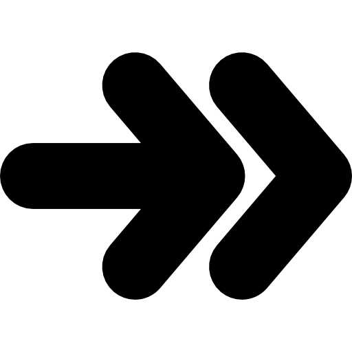 - `<Icon group="universalicons" name="right-arrows" />`
 -  - `<Icon group="universalicons" name="right-triangular-arrowhead" />`
 -  - `<Icon group="universalicons" name="sad-emoticon-square-face" />`
 -  - `<Icon group="universalicons" name="sad-face-variant" />`
 -  - `<Icon group="universalicons" name="sad-face" />`
 -  - `<Icon group="universalicons" name="sale" />`
 -  - `<Icon group="universalicons" name="sd-card-rectangular-shape" />`
 - 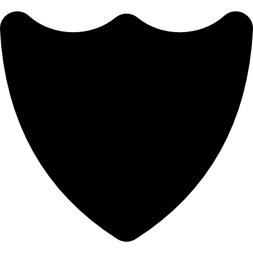 - `<Icon group="universalicons" name="shield-black-shape" />`
 - 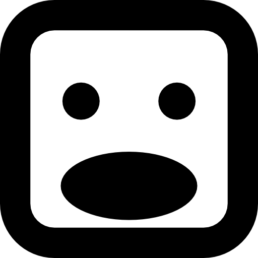 - `<Icon group="universalicons" name="shock-face-of-square-shape-with-opened-oval-mouth" />`
 - 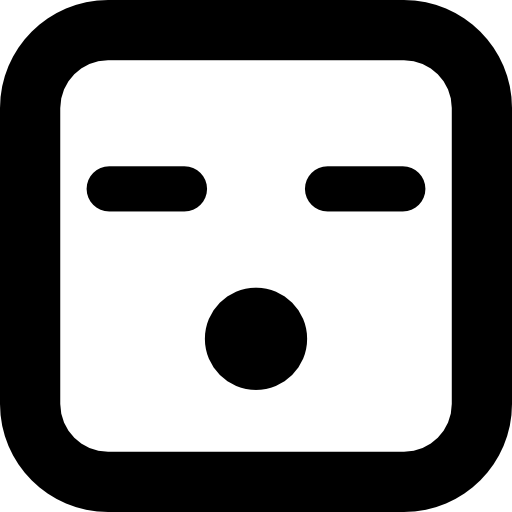 - `<Icon group="universalicons" name="shock-face-of-square-shape" />`
 -  - `<Icon group="universalicons" name="shocked-face-of-square-shape" />`
 -  - `<Icon group="universalicons" name="shopping-trolley" />`
 - 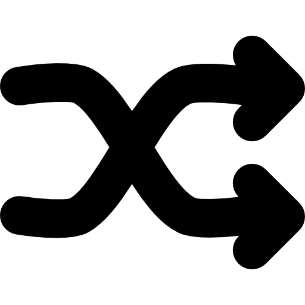 - `<Icon group="universalicons" name="shuffle-arrows-symbol-for-interface" />`
 - 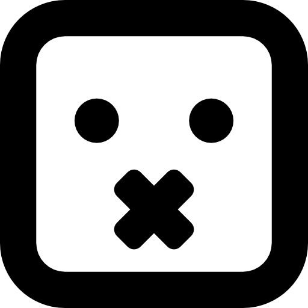 - `<Icon group="universalicons" name="silent-face-with-a-cross-mouth-shape" />`
 - 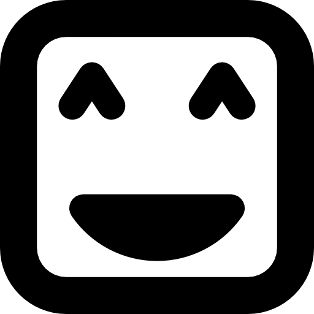 - `<Icon group="universalicons" name="smile-face-of-square-shape-with-closed-happy-eyes" />`
 -  - `<Icon group="universalicons" name="smile-face-with-sunglasses" />`
 -  - `<Icon group="universalicons" name="smile-face" />`
 -  - `<Icon group="universalicons" name="smile-square-face" />`
 -  - `<Icon group="universalicons" name="smiley-in-love" />`
 -  - `<Icon group="universalicons" name="smiley-square-face-with-sunglasses" />`
 - 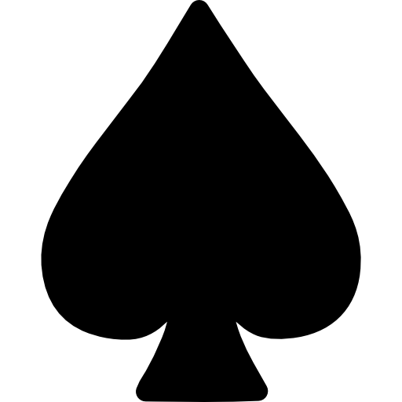 - `<Icon group="universalicons" name="spade-symbol" />`
 - 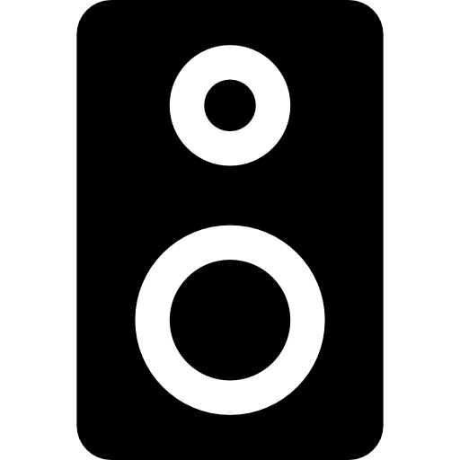 - `<Icon group="universalicons" name="speaker-audio-tool-symbol" />`
 - 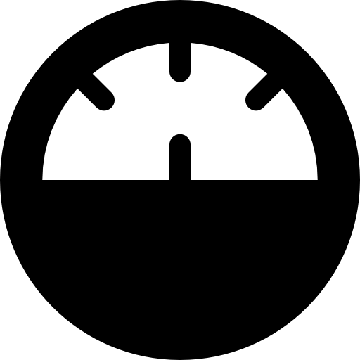 - `<Icon group="universalicons" name="speedometer-circular-tool-symbol-for-speed-control-on-vehicles" />`
 -  - `<Icon group="universalicons" name="square-of-rounded-corners" />`
 -  - `<Icon group="universalicons" name="square-with-verification-sign" />`
 -  - `<Icon group="universalicons" name="star-black-fivepointed-shape" />`
 -  - `<Icon group="universalicons" name="star-tag-black-shape" />`
 - 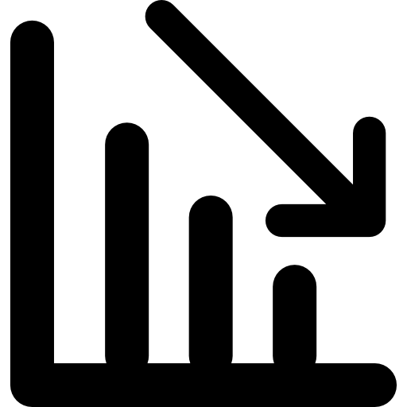 - `<Icon group="universalicons" name="stats-down" />`
 - 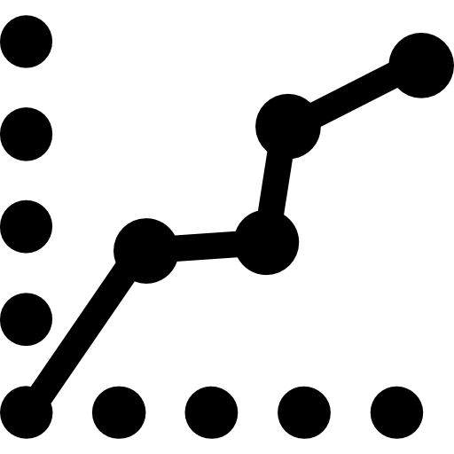 - `<Icon group="universalicons" name="stats-graphic-1" />`
 - 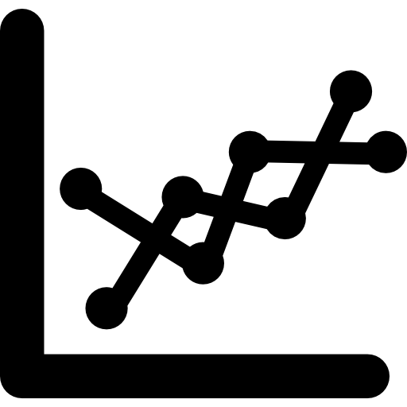 - `<Icon group="universalicons" name="stats-graphic" />`
 -  - `<Icon group="universalicons" name="stats-up-graphic" />`
 -  - `<Icon group="universalicons" name="stats" />`
 -  - `<Icon group="universalicons" name="sterling-pound-sign-of-money" />`
 -  - `<Icon group="universalicons" name="sterling-pounds-coin" />`
 -  - `<Icon group="universalicons" name="stethoscope-medical-tool" />`
 -  - `<Icon group="universalicons" name="straight-face" />`
 -  - `<Icon group="universalicons" name="suitcases" />`
 -  - `<Icon group="universalicons" name="sun-shape" />`
 -  - `<Icon group="universalicons" name="surprised-face" />`
 - 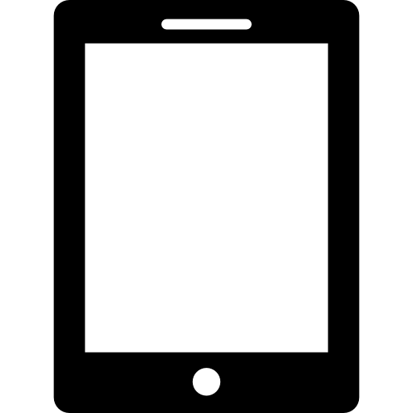 - `<Icon group="universalicons" name="tablet-tool" />`
 -  - `<Icon group="universalicons" name="tag-black-shape" />`
 - 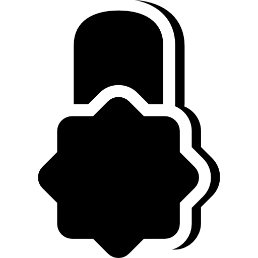 - `<Icon group="universalicons" name="tags-shapes" />`
 -  - `<Icon group="universalicons" name="talk-bubble-with-plus-sign" />`
 -  - `<Icon group="universalicons" name="talk-face-smiley" />`
 - 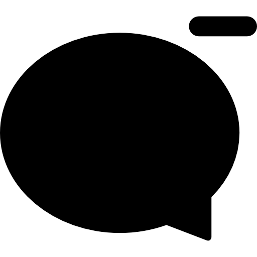 - `<Icon group="universalicons" name="talk-oval-bubble-with-minus-sign" />`
 -  - `<Icon group="universalicons" name="text-document-add-button-with-plus-sign" />`
 -  - `<Icon group="universalicons" name="text-document-square-rounded-shape-with-minus-sign" />`
 - 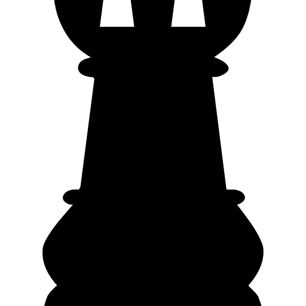 - `<Icon group="universalicons" name="tower-black-chess-piece-shape" />`
 - 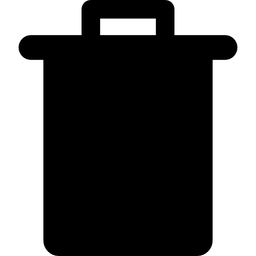 - `<Icon group="universalicons" name="trash-black-shape" />`
 -  - `<Icon group="universalicons" name="trash-can-with-cover-from-side-view" />`
 -  - `<Icon group="universalicons" name="turn-left-arrow-symbol" />`
 -  - `<Icon group="universalicons" name="tv-monitor-tool" />`
 -  - `<Icon group="universalicons" name="two-movie-frames" />`
 -  - `<Icon group="universalicons" name="undo-circular-arrow" />`
 -  - `<Icon group="universalicons" name="university-graduates-cap-silhouette" />`
 -  - `<Icon group="universalicons" name="unlock-padlock-interface-silhouette-symbol" />`
 -  - `<Icon group="universalicons" name="unlock-page-symbol" />`
 -  - `<Icon group="universalicons" name="up-arrow-1" />`
 -  - `<Icon group="universalicons" name="up-arrow-symbol-in-a-circle" />`
 -  - `<Icon group="universalicons" name="up-arrow" />`
 -  - `<Icon group="universalicons" name="up-arrowhead-in-a-circle" />`
 -  - `<Icon group="universalicons" name="up-arrowheads" />`
 -  - `<Icon group="universalicons" name="up-arrows" />`
 - 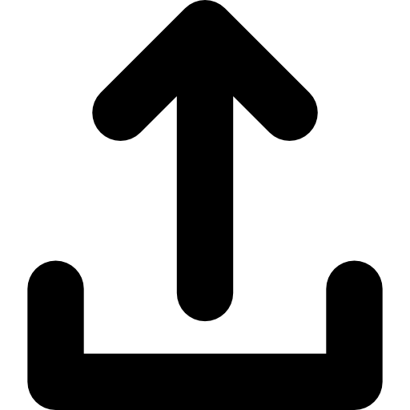 - `<Icon group="universalicons" name="upload" />`
 - 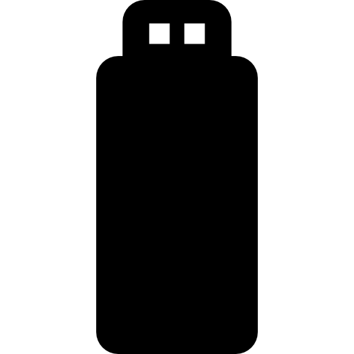 - `<Icon group="universalicons" name="usb-tool" />`
 -  - `<Icon group="universalicons" name="user-check-interface-symbol" />`
 -  - `<Icon group="universalicons" name="user-male-black-shape-with-plus-sign" />`
 -  - `<Icon group="universalicons" name="user-symbol" />`
 -  - `<Icon group="universalicons" name="user-with-cross-sign" />`
 -  - `<Icon group="universalicons" name="user-with-minus-sign-1" />`
 -  - `<Icon group="universalicons" name="user-with-minus-sign" />`
 -  - `<Icon group="universalicons" name="user-with-plus-sign" />`
 -  - `<Icon group="universalicons" name="users-sign" />`
 -  - `<Icon group="universalicons" name="usher-1" />`
 -  - `<Icon group="universalicons" name="usher-2" />`
 -  - `<Icon group="universalicons" name="usher-man-with-tie" />`
 -  - `<Icon group="universalicons" name="usher-shape" />`
 -  - `<Icon group="universalicons" name="usher" />`
 -  - `<Icon group="universalicons" name="video-camera-black-silhouette-symbol" />`
 -  - `<Icon group="universalicons" name="warning-exclamation-sign-in-a-circle" />`
 -  - `<Icon group="universalicons" name="warning-page-symbol" />`
 - 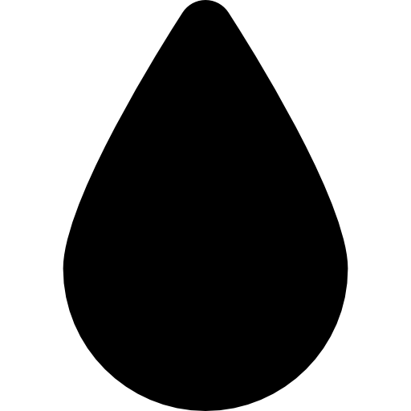 - `<Icon group="universalicons" name="water-drop-black-shape" />`
 - 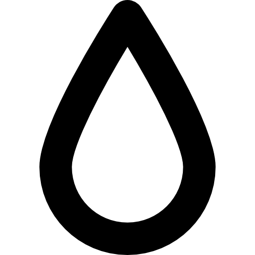 - `<Icon group="universalicons" name="water-drop-shape-outline" />`
 - 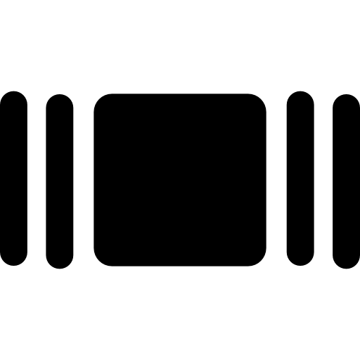 - `<Icon group="universalicons" name="web-square-and-lines-symbol" />`
 - 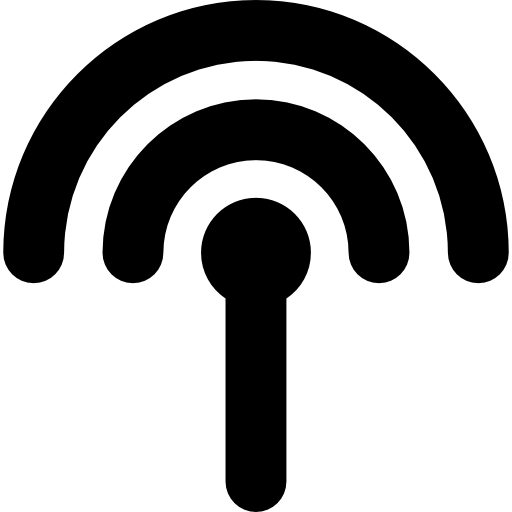 - `<Icon group="universalicons" name="wifi-interface-symbol" />`
 - 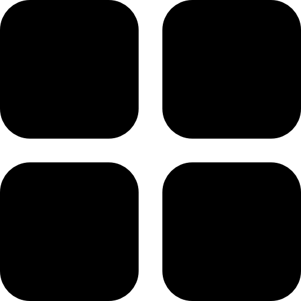 - `<Icon group="universalicons" name="window-of-four-rounded-squares" />`
 -  - `<Icon group="universalicons" name="wink-circular-face-symbol" />`
 -  - `<Icon group="universalicons" name="winking-smiling-face" />`
 - 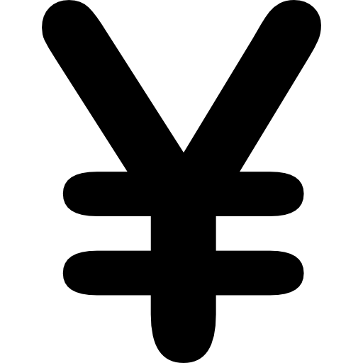 - `<Icon group="universalicons" name="yen-sign" />`